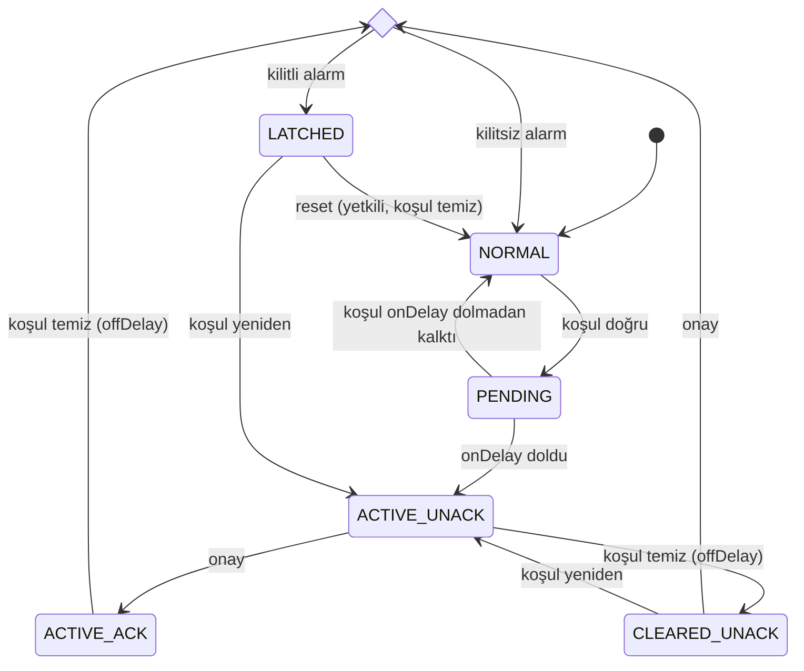

# Alarm ve Olay Modeli

## 1. Kavramlar

| Kavram | Anlam |
|---|---|
| Koşul | Algılanan durum (ör. T1 ≥ limit). Koşul yalnız ölçüm/sistem ile temizlenir |
| Onay (acknowledge) | Operatörün alarmı gördüğünü bildirmesi. Koşulu ve kilidi **değiştirmez** |
| Kilit (latch) | Safety'nin koşul temizlense bile ısıtmayı engelli tutması |
| Sıfırlama (reset) | Kilidin kaldırılması; yalnız koşul temizse ve yetkili kullanıcıyla |

Kelime dağarcığı Suite alarm motoruyla uyumludur (`TICARI_CEKIRDEK.md`): `active_unacknowledged`, `active_acknowledged`, `cleared_unacknowledged`, `closed`; önem `info` / `warning` / `critical`.

## 2. Alarm kataloğu

| Kod | Önem | Koşul (özet) | Kilit | Otomatik temizlenme | Eylem |
|---|---|---|---|---|---|
| `SENSOR_FAULT` | CRITICAL (T1) / WARNING (RH1, T2, aralıklı) | Sensör yok/BAD, aralıklı hata | Hayır | Rol GOOD ≥ 30 s | T1 ise ısıtma durur |
| `SENSOR_STALE` | CRITICAL | T1 yaşı > `sensor_stale_s` | Hayır | GOOD ≥ 30 s | Isıtma durur |
| `OVERTEMPERATURE` | CRITICAL | T1 ≥ `cabin_overtemp_limit` veya T2 ≥ `heater_outlet_limit` | **Evet** | Hayır (koşul temizlenir, kilit kalır) | R OFF, VF zorunlu |
| `HEATER_FAN_FAULT` | CRITICAL | T2/geri bildirim kriteri | **Evet** | Hayır | R OFF |
| `HEATING_TIMEOUT` | CRITICAL | Sürekli ısıtma > limit | **Evet** | Hayır | R OFF |
| `HEATING_PERFORMANCE_LOW` | WARNING | HPM kuralı | Hayır | Koşul 10 dk yok | Bilgi |
| `UNEXPECTED_TEMPERATURE_RISE` | WARNING / CRITICAL | S9 | CRITICAL'de evet | WARNING'de koşul yok 10 dk | CRITICAL'de R OFF |
| `OUTPUT_FAULT` | CRITICAL | Geri bildirim uyuşmazlığı (donanım varsa) | **Evet** | Hayır | ARM=0 |
| `MQTT_OFFLINE` | WARNING | Broker yok > 60 s (broker yapılandırılmışsa) | Hayır | Bağlantı | Yok (kontrol sürer) |
| `WIFI_OFFLINE` | WARNING | STA bağlı değil > 60 s | Hayır | Bağlantı | Yok |
| `CONFIGURATION_ERROR` | CRITICAL | Geçersiz/bozuk config | Hayır | Geçerli config kaydedilince | Isıtma kilitli (FAILSAFE) |
| `WATCHDOG_RESET` | WARNING | Boot'ta reset nedeni WDT/PANIC | Hayır | Onayla kapanır (koşul anlık) | Bilgi |
| `RESTART_STORM` | CRITICAL | faultBoots eşiği | **Evet** | Hayır | RECOVERY |
| `INTERNAL_FAULT` | CRITICAL | Görev heartbeat, iç tutarsızlık | **Evet** | Reboot + self-test | R OFF, ARM=0 |
| `FROST_RISK_NO_SENSOR` | CRITICAL | S19 | Hayır | Sensör GOOD | Bilgi (ısıtma yapılamaz) |
| `HUMIDITY_HIGH` | INFO | RH > limit ve havalandırma inhibit | Hayır | Koşul yok | Bilgi |
| `HUMIDITY_LOW` | INFO | RH < `humidity_low_limit` 30 dk | Hayır | Koşul yok | Bilgi |
| `TIME_INVALID` | INFO | Saat kaynağı yok (NTP yapılandırılmışsa) | Hayır | Saat geçerli | Zaman tabanlı özellikler durur |
| `RELAY_LIFE_WARNING` | INFO | `switch_count ≥ %80 relay_life_cycles` | Hayır | Sayaç reseti | Bakım |
| `POST_COOL_TIMEOUT` | WARNING | T2 kriteri `post_cool_max_s` içinde sağlanmadı | Hayır | Sonraki başarılı post-cool | Fan açık kalır |

**DESIGN DECISION:** SERVICE modunda INFO/WARNING alarmları bastırılır (olay günlüğüne yazılır, `suppressed=true`); CRITICAL alarmlar bastırılmaz.

## 3. Alarm durum makinesi



- `onDelay`/`offDelay` alarm başına (ör. `OVERTEMPERATURE` 10 s / 60 s; `MQTT_OFFLINE` 60 s / 0).
- Yeniden oluşan koşul yeni **occurrence** (artan `occ_id`) üretir; sürekli koşul tekrar üretmez.
- `LATCHED` durumunda `alarm=ON`, `alarm_state` alarmın önemidir; UI "Sıfırlama gerekli" gösterir.
- Onay kalıcıdır (alarm kaydıyla birlikte flash'a); reboot sonrası kilitli alarmlar ve onay durumları geri yüklenir (**DESIGN DECISION**: kilit reboot ile kaybolmaz, aksi hâlde reboot kilit atlatma yolu olur). İstisna: `INTERNAL_FAULT` kilidi başarılı self-test ile kalkar.

### 3.1 Özet alanlar

| Alan | Hesap |
|---|---|
| `alarm` | Herhangi alarm `ACTIVE_*`, `CLEARED_UNACK` veya `LATCHED` |
| `alarm_state` | Bu alarmların en yüksek önemi; yoksa `NORMAL` |
| `active_alarm_count` | `ACTIVE_*` + `LATCHED` sayısı |
| `unacked_alarm_count` | `ACTIVE_UNACK` + `CLEARED_UNACK` |

## 4. Suite ile ilişki

Cihaz alarmları cihazda üretilir ve yerelde görünür; Suite'e özet entity'ler ve `B/alarm/state` ile taşınır. Suite'in kalıcı alarm motoru (proje kuralları) `alarm` noktasına `binary_active` kuralı ile bağlanarak bildirim/onay akışını kendi tarafında yürütebilir. **İki taraftaki onaylar bağımsızdır**; cihaz onayı `alarm_ack` butonuyla Suite'ten tetiklenebilir. **OPEN ISSUE:** Suite onayının otomatik olarak cihaza aktarılması (çift onay yükünü azaltmak) Suite geliştirmesi gerektirir.

## 5. Olay günlüğü

### 5.1 Kayıt yapısı

| Alan | Tür | Not |
|---|---|---|
| `seq` | uint32 | Kalıcı, monoton; boot'ta kalıcı üst sınırdan devam eder (rezervasyon blokları, baseline §9) |
| `up` | uint32 s | Uptime |
| `ts` | uint32 epoch | Saat geçerliyse; değilse 0 ve UI uptime gösterir |
| `boot` | uint16 | Boot sayacı (reset sınırı görünür) |
| `sev` | enum | `DEBUG`, `INFO`, `WARNING`, `CRITICAL` |
| `src` | enum | `STATE`, `SAFETY`, `CONTROLLER`, `OUTPUT`, `ALARM`, `COMMAND`, `CONFIG`, `NET`, `SYSTEM`, `SERVICE` |
| `code` | uint16 + sabit ad | ör. `STAGE2_ON`, `POST_COOL_START` |
| `actor` | enum | `LOCAL_WEB`, `MQTT`, `LOCAL_SERVICE`, `CONTROLLER`, `SAFETY`, `SYSTEM` + kullanıcı adı özeti (web) |
| `val` | float | İlgili değer (T1, talep …) |
| `msg` | ≤ 40 bayt UTF-8 | Sabit şablon + parametre; kullanıcı girdisi sırsız ve kırpılmış |

Örnek akış (prompttaki senaryo):

```text
14:21:03 INFO  STATE      Isıtma başladı (T1 20.4, SP 22.0)
14:21:03 INFO  OUTPUT     Isıtıcı fanı ON (prepurge)
14:21:06 INFO  OUTPUT     R1 ON
14:23:18 INFO  CONTROLLER Kademe 2 (talep 57 %) → R2 ON
14:26:11 INFO  CONTROLLER Setpoint'e ulaşıldı
14:26:12 INFO  OUTPUT     R2 OFF
14:27:20 INFO  OUTPUT     R1 OFF
14:27:20 INFO  STATE      Soğutma (post-cool) başladı, 60 s
14:28:20 INFO  OUTPUT     Isıtıcı fanı OFF
```

**DESIGN DECISION:** Zaman-oransal modülasyonun her pencere içi ON/OFF'u olay **değildir** (günde binlerce kayıt); yalnız kademe değişimi, kanalın ilk açılışı/son kapanışı (ısıtma dönemi sınırları) ve interlock kaynaklı zorlamalar kaydedilir. Pencere anahtarlaması sayaçlara yansır.

### 5.2 Tamponlar ve kalıcılık

| Katman | Kapasite | İçerik | Yazım |
|---|---|---|---|
| RAM halkası | 200 kayıt (~10 KB) | Tüm INFO+ olaylar | — |
| Kalıcı halka (LittleFS, sabit boyutlu dosya, kayıt başına CRC) | 64 kayıt | WARNING+ olaylar, alarm geçişleri, boot, config değişimi, servis işlemleri | Olay başına tek kayıt yazımı; aynı koddan 60 s içinde en çok 1 (hız sınırı, sayılır) |
| MQTT `B/event` | — | INFO+ canlı akış | Bağlıysa |

- Flash aşınması: 64 × 64 B = 4 KB tek dosya, yerinde döngüsel yazım; LittleFS aşınma dengeleme + hız sınırı → tipik ≤ 50 yazma/gün (NFR-04).
- Reboot: RAM halkası boşalır; kalıcı halka okunur ve UI'da "önceki oturum" ayrımıyla gösterilir. Kayıp aralığı (`seq` boşluğu) açık yazılır.
- Taşma: en eski kayıt ezilir, `event_overwritten` sayacı artar.
- Güç kesintisinde son ≤ 1 kayıt kaybolabilir (yazım ortasında kesinti CRC ile atılır).

**FUTURE ENHANCEMENT:** HMAC zincirli denetim kaydı ve uzak toplayıcı (baseline §9) — v1'de gerek yok; konfigürasyon ve servis olayları kalıcı halkada yeterli.
