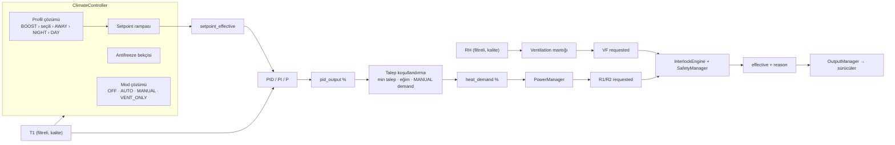
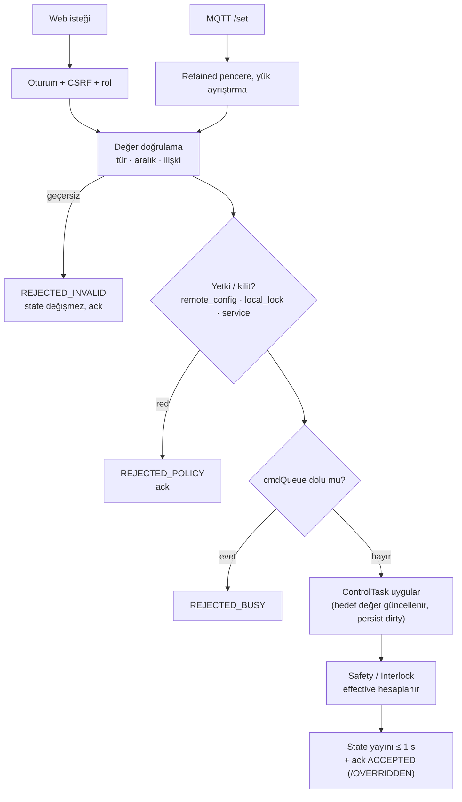

# Kontrol Mimarisi

## 1. Kontrol zinciri



Her kat yalnız bir sonraki katın **girdisini** üretir. Hiçbir üst kat alt katın kararını atlayamaz; atlama yetkisi yalnız Safety/Interlock katmanındadır ve daima **daha güvenli** yöndedir.

## 2. Çalışma modları

### 2.1 Değerlendirme: AUTO ve PID birleşmeli mi?

| Seçenek | Artı | Eksi |
|---|---|---|
| Ayrı `AUTO` (termostat/histerezis) ve `PID` modu | Basit yedek algoritma | Kullanıcıya algoritma seçimi yükler; iki ayrı ayarlanacak davranış; test matrisi ikiye katlanır |
| **Tek `AUTO`, algoritma bir ayar (`pid_mode`: P / PI / PID / ONOFF)** | Kullanıcı niyet seçer (otomatik), mühendis algoritma seçer; mod geçişleri sade | Algoritma değişimi servis/konfigürasyon işi olur |

**DESIGN DECISION:** `AUTO` ve `PID` birleştirilir. Kullanıcı modu `operating_mode`; algoritma `pid_mode` konfigürasyonudur. `ONOFF` (histerezisli iki nokta) yedek algoritma olarak `pid_mode` içinde bulunur (bozuk ayar veya devreye alma için).

### 2.2 Mod kataloğu

| `operating_mode` | Isıtma | Havalandırma | Antifreeze | Seçilebildiği yer |
|---|---|---|---|---|
| `OFF` | Kapalı | Yalnız güvenlik/aşırı sıcaklık | **Etkin** | Web, MQTT, Programs/Kurallar |
| `AUTO` | PID → PowerManager | Otomatik kurallar | Etkin (zaten ısıtır) | Web, MQTT |
| `MANUAL` | `manual_heat_demand` % → PowerManager (PID izleme modunda) | Manuel/otomatik | Etkin | Web, MQTT (config: `remote_manual_allowed`) |
| `VENT_ONLY` | Kapalı | Otomatik + manuel | Etkin | Web, MQTT |
| `SERVICE` | Test çıkışları (interlock altında) | Test | **Devre dışı** (uyarı gösterilir) | Yalnız yerel web, yönetici + servis PIN'i |

`FAILSAFE` bir mod değildir; Safety Manager'ın zorladığı **durumdur** (`controller_state`). `ANTIFREEZE` de mod değil, tüm normal modlarda çalışan bir korumadır; etkin olduğunda `controller_state=HEATING` ve `heating_reason=ANTIFREEZE` raporlanır.

**DESIGN DECISION:** `SERVICE` modu MQTT'den seçilemez; web oturumu kapanırsa veya `service_timeout_min` (varsayılan 30) dolarsa otomatik olarak önceki moda döner.

### 2.3 Mod geçişleri

| Geçiş | Davranış |
|---|---|
| AUTO → MANUAL | Bumpless: `manual_heat_demand` son `heat_demand` ile başlatılır (kullanıcı aksi belirtmedikçe) |
| MANUAL → AUTO | Bumpless: PID integratörü mevcut talebi verecek şekilde geri hesaplanır ([PID_DESIGN §6](PID_DESIGN.md)) |
| AUTO/MANUAL → OFF / VENT_ONLY | Talep 0; PowerManager kademeleri min-on sürelerine uyarak kapatır; POST_COOL |
| Herhangi → SERVICE | Önce talep 0 + POST_COOL tamamlanır; sonra test izni |
| SERVICE → önceki | Test çıkışları bırakılır, POST_COOL, önceki mod |

## 3. Profiller ve setpoint çözümü

### 3.1 Profil kataloğu (başlangıç değerleri)

| Profil | Setpoint anahtarı | Varsayılan | Not |
|---|---|---|---|
| DAY | `temperature_setpoint` | 21.0 °C | Kullanıcının ana (konfor) setpoint'i |
| NIGHT | `setpoint_night` | 18.0 °C | |
| AWAY | `setpoint_away` | 12.0 °C | |
| FROST | `setpoint_frost` | 5.0 °C | Antifreeze bekçisi de bunu kullanır |
| BOOST | `setpoint_boost` + `boost_minutes` | 23.0 °C / 30 dk | Süreli; süre dolunca kendiliğinden kapanır |

### 3.2 Girdiler

| Entity | Tür | Kaynak |
|---|---|---|
| `profile` | select: `DAY`/`NIGHT`/`AWAY`/`FROST` | Kullanıcının **açık** seçimi (web, MQTT, Programs) |
| `sched_night` | switch | Programs / Kurallar istek kanalı |
| `sched_away` | switch | Programs / Kurallar istek kanalı |
| `boost` | switch (süreli) | Web, MQTT |

### 3.3 Çözüm önceliği

**DESIGN DECISION:** `profile_active` şu sırayla çözülür ([ADR-005](ADR/ADR-005-profile-resolution-programs.md)):

1. `boost = ON` ve süre dolmadı → **BOOST**
2. `profile ≠ DAY` (açık kullanıcı seçimi) → **o profil**
3. `sched_away = ON` → **AWAY**
4. `sched_night = ON` → **NIGHT**
5. aksi → **DAY**

Gerekçe: açık kullanıcı seçimi zamanlamadan üstündür; BOOST geçici ve kullanıcı eylemidir; zamanlama yalnız "varsayılan (DAY)" durumunu değiştirir. Programs, doğası gereği AÇ/KAPAT talebi ürettiği için anahtar kanalına eşlenir (PROGRAMLAR.md §3).

`setpoint_effective = ramp(setpoint[profile_active])`. `setpoint_source` sensörü (`DAY`, `NIGHT`, `AWAY`, `FROST`, `BOOST`, `ANTIFREEZE`, `MANUAL`) nedeni gösterir.

- **OPEN ISSUE:** Yerel haftalık program (Suite yokken NIGHT'a geçiş) v1'de yok; Suite kesikken zamanlanmış profil geçişi olmaz, son durum korunur. **FUTURE ENHANCEMENT:** baseline §4 haftalık program modülü.
- **ASSUMPTION:** Suite kesildiğinde `sched_*` anahtarları son değerinde kalır. **DESIGN DECISION:** `sched_*` için `sched_timeout_h` (varsayılan 16 sa) — ON kalan istek bu süre sonunda kendiliğinden OFF olur ve `SCHEDULE_REQUEST_EXPIRED` INFO olayı üretir (takılı gece profilini önler).

### 3.4 Antifreeze bekçisi

```text
IF antifreeze_enabled
   AND mode ∈ {OFF, VENT_ONLY, AUTO, MANUAL}
   AND T1.quality = GOOD
   AND T1 < frost_guard_temperature (4.0 °C)
THEN heating_reason = ANTIFREEZE, setpoint = setpoint_frost, algoritma = AUTO PID
EXIT WHEN T1 ≥ setpoint_frost + frost_exit_hysteresis (1.0 °C)
```

- `MANUAL`'da `manual_heat_demand` düşükse antifreeze talebi ile büyük olanı alınır (`max`).
- Sensör kalitesi kötü ise antifreeze ısıtamaz (FAILSAFE kuralları geçerlidir). **OPEN ISSUE:** Sensör arızasında donma riski — T2 veya ikinci ortam sensörü yedekli ölçüm önerilir; açık-döngü "koruyucu duty" (ör. %15) seçeneği güvenlik açısından **önerilmez** ve v1'de yoktur.

## 4. Zamanlama ayrımı

| Döngü | Başlangıç değeri | Aralık | Not |
|---|---|---|---|
| Sensör örnekleme | 1 s | 0.5–10 s | Sensör dönüşüm süresine bağlı (DS18B20 12-bit ≈ 750 ms) |
| Kontrol (PID) | 2 s | 1–30 s | Kulübe termal zaman sabiti dakikalar mertebesinde |
| Safety değerlendirme | 250 ms | sabit | |
| Output penceresi (SSR) | 20 s | 5–120 s | Sürücü profiline göre ([OUTPUT_AND_INTERLOCKS §3](OUTPUT_AND_INTERLOCKS.md)) |
| Output penceresi (röle) | 600 s | 300–1800 s | |
| Web UI yenileme | 1 s | istemci | `/api/data` |
| MQTT `state` | değişimde + 5 s aktif / 30 s boşta | 1–60 s | Ölçümde deadband: T 0.1 °C, RH 0.5 % |
| MQTT `diag/state` | 60 s | 30–300 s | |
| MQTT `avail` | 30 s | sabit | Sözleşme |
| HPM analiz penceresi | 10 dk kayan | 5–30 dk | |

## 5. Isıtma / havalandırma koordinasyonu

### 5.1 Havalandırma istek kaynakları

| Kaynak | Koşul (başlangıç) | Tür |
|---|---|---|
| TEMP_HIGH | `T1 > ventilation_start_temperature` (26 °C), çıkış `< ventilation_stop_temperature` (24 °C) | Otomatik |
| HUMIDITY_HIGH | `RH > humidity_high_limit` (75 %), çıkış `< humidity_high_limit − humidity_hysteresis` (5 %) | Otomatik |
| MANUAL | `ventilation_fan_manual = ON` | Operatör |
| SCHEDULED | `ventilation_periodic_min` / saat (varsayılan 0 = kapalı) | Otomatik |
| OVERTEMP | Safety tetik | Güvenlik |
| FUTURE | CO₂ / VOC eşiği | Otomatik |

### 5.2 Öncelik tablosu

| # | Durum | Isıtma | Havalandırma | Gerekçe |
|---|---|---|---|---|
| 1 | Safety tripi: OVERTEMPERATURE | Kapalı + kilit | **ON** (`reason=OVERTEMPERATURE`) | Sıcaklık tahliyesi; rezistans kapalı |
| 2 | Safety: SENSOR_FAULT / CONFIG / INTERNAL | Kapalı | Kullanıcının manuel isteği korunur, otomatik kurallar durur | Ölçüm yokken otomatik karar verilmez |
| 3 | Antifreeze aktif | Açık | **Inhibit** (manuel dahil; `reason=ANTIFREEZE_INHIBIT`) | Donma riski havalandırmadan önemlidir |
| 4 | MANUAL havalandırma, ısıtma aktif | Açık | `manual_vent_priority` ayarına göre: `VENT_WINS` → ısıtma talebi `heat_demand ≤ vent_heat_cap` (varsayılan 0 %); `HEAT_WINS` → havalandırma inhibit | Kullanıcı açıkça istedi; enerji israfı riski ayarla yönetilir (varsayılan `VENT_WINS`, ısıtma durur) |
| 5 | HUMIDITY_HIGH, ısıtma aktif | Açık | `humidity_vent_while_heating`: `INHIBIT` (varsayılan) / `ALLOW` / `ALLOW_ABOVE_SP` (yalnız `T1 ≥ SP − 0.5`) | Soğuk havayı içeri almak ısıtmayı zorlar; yoğuşma riski için kullanıcı seçer |
| 6 | TEMP_HIGH | Isıtma zaten olmaz (T1 ≫ SP) | ON | |
| 7 | Isıtma aktif, otomatik vent isteği yok | Açık | OFF | |
| 8 | Isıtma → vent geçişi | Isıtma durduktan sonra `heat_vent_changeover_s` (120 s) bekler | | Sıcak havanın hemen atılmasını ve kısa döngüyü önler |
| 9 | Vent → ısıtma geçişi | Vent otomatik kapandıktan `vent_heat_changeover_s` (60 s) sonra | | |

**DESIGN DECISION:** "Isıtırken gereksiz havalandırma yapılmaz" varsayılandır; istisnalar (manuel, nem) açık ayardır ve UI'da nedenleriyle gösterilir.

### 5.3 Setpoint ile havalandırma eşiği ilişkisi

`ventilation_start_temperature ≥ setpoint_effective + vent_sp_margin (2 °C)` şartı çalışma zamanında zorlanır; BOOST gibi yüksek setpoint aktifken havalandırma eşiği otomatik olarak `SP + margin`'e çıkar (`ventilation_start_effective` raporlanır). Aksi hâlde ısıtma ve havalandırma birbirine karşı çalışabilir.

## 6. Komut arbitrasyonu

### 6.1 Kaynaklar

| Kaynak kodu | Açıklama | Varsayılan yetki |
|---|---|---|
| `SAFETY` | Safety Manager | Her şey (yalnız güvenli yönde) |
| `INTERLOCK` | Interlock motoru | Çıkışlar (yalnız güvenli yönde) |
| `LOCAL_SERVICE` | Yerel web, servis modu | Test çıkışları, kalibrasyon, reset |
| `LOCAL_WEB` | Yerel web, operatör | Operasyonel + konfigürasyon |
| `MQTT` | Suite kullanıcıları, Kurallar, Programs, HA | Operasyonel; konfigürasyon `remote_config_enabled` ise |
| `CONTROLLER` | PID/PowerManager/vent otomatiği | Çıkış istekleri |
| `BUTTON` | Fiziksel buton (varsa) | Kurtarma/AP |

**ASSUMPTION:** Cihaz MQTT içinde Suite kullanıcısı, Program ve Kural komutlarını ayırt edemez (hepsi aynı `/set` topic'i). Programs için ayrı kanal olarak `sched_*` anahtarları vardır.

### 6.2 Kurallar

1. **Hedef değer semantiği, son yazan kazanır:** Setpoint, mod, profil gibi operasyonel değerler kaynaktan bağımsız son geçerli yazımı alır; her değişim `last_command_source` ve olay günlüğüne yazılır.
2. **Yerel kilit:** `local_lock` (yalnız web'den ayarlanır, süreli: 15 dk–24 sa) etkinken MQTT operasyonel komutları `REJECTED_LOCAL_LOCK` ile reddedilir. Programs'ın `sched_*` istekleri kaydedilir ama kilit bitene kadar profil çözümüne alınmaz (`reason=LOCAL_LOCK`).
3. **Konfigürasyon yazımı:** MQTT'den yalnız `remote_config_enabled=true` ise ve alan "remote writable" ise ([CONFIGURATION_MODEL.md](CONFIGURATION_MODEL.md)).
4. **Servis komutları:** MQTT servis kanalı varsayılan kapalı; açıksa yalnız allowlist (alarm reset, diag snapshot, reboot) ve `service_token` ile ([SECURITY.md](SECURITY.md)).
5. **Hiçbir kaynak** çıkışları doğrudan sürmez; yalnız istek/hedef değeri değiştirir.
6. **Safety her zaman üstün:** Programs/Kurallar Safety kararını geri alamaz; reddedilen istek `B/ack` ile görünür.



`ACCEPTED` ile `OVERRIDDEN` farkı: istek kaydedildi, ancak etkin durum Safety/Interlock nedeniyle farklı (ör. `heater_fan_manual=OFF` kabul, fan yine ON). Bu durumda Suite doğrulaması başarılıdır (istek alanı değişti); etkin durum ayrı entity'de görünür ([ADR-003](ADR/ADR-003-requested-effective-model.md)).

## 7. MANUAL modun sınırları

- `manual_heat_demand` 0–100 %, adım 5. PowerManager ve tüm interlock/safety kuralları aynen uygulanır.
- MANUAL'da `max_continuous_heating_min` ve `cabin_overtemp_limit` geçerlidir.
- **DESIGN DECISION:** `manual_timeout_h` (varsayılan 8 sa) sonunda MANUAL → AUTO (unutulmuş manuel ısıtmayı önler), `MANUAL_TIMEOUT` olayı.
