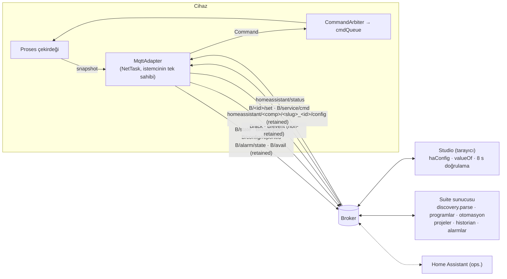

# MQTT Suite Entegrasyonu

Bu belge **yeni bir protokol tanımlamaz.** Temel `ESP_MQTT_SOZLESMESI.md` (topic şeması, discovery, `value_template` kısıtı, erişilebilirlik üçlüsü, 8 s doğrulama, köprü kipi tuzağı) aynen uygulanır; burada yalnız bu cihaza özgü eşleme ve ekler vardır. Eklerin tamamı sözleşmenin serbest bıraktığı alanlardadır (ek state topic'leri `stat_t` ile bağlanır, ek topic'ler Suite tarafından yok sayılır).

## 1. Mimari



## 2. Kimlik

| Alan | Değer | Kural |
|---|---|---|
| `TABAN` | `mqttsuite/climate` | Kullanıcı önerisiyle uyumlu, sözleşmedeki `<TABAN>` |
| `SLUG` | ör. `kulube_iklim_01` | `[a-z0-9_]`, kurulumda üretilir (`kulube_iklim_` + MAC son 3 bayt varsayılan), sonradan değişimi **taşınma** prosedürüdür |
| `B` | `mqttsuite/climate/<SLUG>` | Tüm cihaz topic'lerinin tabanı |
| MQTT client ID | `SLUG` | Sabit; rastgele ek yok |
| `dev.ids` | `["<SLUG>"]` | Tüm entity'lerde aynı → Studio'da tek cihaz |
| `dev.name` | `Kulübe İklim <SLUG son ek>` — **kurulumda sabitlenir** | Suite entity kimliği `src|dev|name` biçiminde ad tabanlıdır (`discovery.py`, `studio_tpl.html addEnt`); cihaz adı değişirse Suite bağlamaları kopar. Web UI'daki "görünen ad" discovery'ye yansımaz (**DESIGN DECISION**) |
| `dev.mf` / `dev.mdl` / `dev.sw` / `dev.hw` | `Kendi Yapımı` / `ESP32-S3 Climate PID` / fw sürümü / hw rev | |
| `origin.name` | `esp-climate-node` | İçinde `bridge`/`köprü` geçmez (köprü kipi tuzağı); kaynak `ha` olur |
| Entity `name` | [ENTITY_MODEL.md](ENTITY_MODEL.md) tablosundaki sabit Türkçe ad | Firmware sürümleri arasında değiştirilmez; değişirse sürüm notunda "Suite bağlama göçü" gerekir |

## 3. Topic kataloğu

| Topic | Yön | Retain | QoS (hedef) | Frekans | İçerik |
|---|---|---|---|---|---|
| `B/state` | Cihaz → | Evet | 1 | Değişimde (≤ 1 s), aktif 5 s, boşta 30 s | Proses snapshot'ı, **eksiksiz** düz JSON (§4.1) |
| `B/diag/state` | Cihaz → | Evet | 0 | 60 s + önemli değişim | Tanı, sayaçlar (§4.2) |
| `B/config/reported` | Cihaz → | Evet | 1 | Değişimde + bağlantıda | Sırsız konfigürasyon + revizyon (§4.3) |
| `B/alarm/state` | Cihaz → | Evet | 1 | Değişimde | Aktif alarm listesi (§4.4) |
| `B/avail` | Cihaz/LWT → | Evet | 1 | Bağlantı + 30 s | `online` / `offline` |
| `B/ack` | Cihaz → | Hayır | 1 | Her komut | Komut sonucu (§6.3) |
| `B/event` | Cihaz → | Hayır | 0 | Olay | Olay günlüğü satırı (§4.5) |
| `B/history/heat_minutes_daily` | Cihaz → | Evet | 1 | Gün devri, bağlantı, saatlik | Günlük geçmiş penceresi (§4.6) |
| `B/<entity>/set` | → Cihaz | **Hayır** | 1 | — | Operasyonel ve konfigürasyon komutu |
| `B/service/cmd` | → Cihaz | Hayır | 1 | — | Servis zarfı; varsayılan **kapalı** (§6.4) |
| `homeassistant/<comp>/<SLUG>_<id>/config` | Cihaz → | Evet | 1 | Bağlantı, `homeassistant/status=online` (≥ 10 s aralık) | Discovery |
| `homeassistant/status` | → Cihaz | — | 1 abone | — | Discovery tekrarı |

**OPEN ISSUE — QoS:** PubSubClient yalnız QoS 0 yayınlar. Hedef QoS 1 için ESP-IDF `esp-mqtt` (Arduino-ESP32 çekirdeğinde mevcut; kendi görevinde çalışır, tampon ayarlanabilir) önerilir. Kütüphane seçimi implementasyon öncesi karardır; tasarım QoS 0 ile de doğru çalışır (retained snapshot + periyodik tam yayın).

Tampon: keşif yükü ≈ 450–700 B, `B/state` ≈ 1.4 KB → **2048 B** (sözleşmedeki 1024 B bu cihaz için yetmez).

## 4. Payload sözleşmeleri

### 4.1 `B/state` (düz, tam snapshot)

**DESIGN DECISION:** İkili değerler `"ON"`/`"OFF"` string'i olarak yayınlanır (Studio `isOn` hem `true` hem `"ON"` kabul eder; Home Assistant'ın `binary_sensor`/`switch` şablonları için `"ON"`/`"OFF"` hatasız eşleşir). Prompttaki `true/false` örneğinden bu nedenle ayrılınmıştır. Geçersiz ölçüm `null`dır, 0 değildir.

```json
{
  "v": 1, "seq": 18244, "ts": 1790253600, "uptime": 86412,
  "temperature": 21.8, "humidity": 48.2, "temperature_quality": "GOOD", "humidity_quality": "GOOD",
  "t2": null, "t2_quality": "DISABLED", "sensor_ok": "ON", "sensor_age_s": 1,
  "temperature_setpoint": 22.0, "setpoint_effective": 21.6, "setpoint_source": "DAY",
  "profile": "DAY", "profile_active": "DAY", "sched_night": "OFF", "sched_away": "OFF", "boost": "OFF", "boost_remaining_min": 0,
  "operating_mode": "AUTO", "controller_enable": "ON",
  "controller_state": "HEATING", "heating_phase": "ACTIVE", "ventilation_state": "OFF",
  "heating_reason": "PID", "failsafe_reason": "NONE",
  "pid_output": 46.1, "heat_demand": 43.5, "manual_heat_demand": 40, "r1_duty": 87.0, "r2_duty": 0.0, "power_stage": 1,
  "temperature_rate": 0.9,
  "r1_active": "ON", "r2_active": "OFF", "heater_fan_active": "ON", "ventilation_fan_active": "OFF",
  "heating_active": "ON", "ventilation_active": "OFF",
  "heater_fan_manual": "OFF", "ventilation_fan_manual": "OFF",
  "r1_reason": "NONE", "r2_reason": "NONE", "heater_fan_reason": "HEATER_INTERLOCK", "ventilation_fan_reason": "NONE",
  "overtemperature": "OFF", "alarm": "OFF", "alarm_state": "NORMAL", "active_alarm_count": 0, "unacked_alarm_count": 0,
  "local_lock": "OFF", "last_command_source": "MQTT", "ack_count": 3
}
```

- `seq` her yayında artar (tüketici tazeliği ve sıra kontrolü); `ts` saat geçerliyse epoch, değilse alan yazılmaz.
- Değer yuvarlama cihazda: T 0.1 °C, RH 0.1 %, yüzdeler 0.1.
- Alan adları `[a-z0-9_]`; hiçbir alan iç içe değildir.

### 4.2 `B/diag/state`

```json
{"v":1,"uptime":86412,"reset_reason":"POWER_ON","boot_count":37,"fault_boot_count":1,
 "free_heap":182340,"min_heap":151220,"wifi_rssi":-61,"ip":"192.168.1.57","mqtt_reconnects":2,
 "control_loop_ms":3,"control_loop_max_ms":11,"safety_loop_max_ms":2,"cmd_queue_max":2,
 "sensor_error_count":0,"sensor_crc_errors":0,"sensor_error_rate_10m":0.0,"sensor_model":"SHT41@0x44",
 "r1_hours":412.6,"r2_hours":188.1,"heater_fan_hours":655.0,"ventilation_fan_hours":90.3,
 "r1_switch_count":20511,"r2_switch_count":9120,"heater_fan_switch_count":2210,"ventilation_fan_switch_count":480,
 "heating_minutes_today":214,"duty_cycle_24h":31.2,"heating_cycles_1h":2,"heating_efficiency_index":0.12,
 "time_valid":"ON","fw_version":"1.0.0","fw_build":"r12","hw_rev":"A","config_rev":44}
```

### 4.3 `B/config/reported`

Sırsız düz yansıma; konfigürasyon `number`/`select`/`switch` entity'lerinin state kaynağıdır (her konfigürasyon entity'sinin `stat_t`'si bu topic'tir).

```json
{"v":1,"config_rev":44,"config_hash":"9f2c1a07",
 "setpoint_night":18.0,"setpoint_away":12.0,"setpoint_frost":5.0,"setpoint_boost":23.0,"boost_minutes":30,
 "pid_mode":"PI","pid_kp":20.0,"pid_ki":1.0,"pid_kd":0.0,"setpoint_ramp_c_per_min":0.2,
 "humidity_high_limit":75,"humidity_low_limit":30,"humidity_hysteresis":5,
 "ventilation_start_temperature":26.0,"ventilation_stop_temperature":24.0,
 "post_cool_seconds":60,"max_heat_demand":100,"antifreeze_enabled":"ON","frost_guard_temperature":4.0,
 "humidity_vent_while_heating":"INHIBIT","manual_vent_priority":"VENT_WINS",
 "remote_config_enabled":"OFF","output_driver_r":"SSR_ZC"}
```

### 4.4 `B/alarm/state`

Liste içerir; Suite bunu entity değeri olarak **okuyamaz** (iç içe). Özet alanlar (`alarm`, `alarm_state`, `active_alarm_count`) `B/state`'tedir. Bu topic web dışı tüketiciler ve `json_attr_t` ile HA öznitelikleri içindir.

```json
{"v":1,"active":[{"code":"HEATING_PERFORMANCE_LOW","sev":"WARNING","state":"ACTIVE_UNACK","since":1790250000,"latched":false}],
 "highest":"WARNING","count":1,"unacked":1}
```

### 4.5 `B/event`

```json
{"v":1,"seq":5520,"ts":1790253661,"up":86473,"sev":"INFO","src":"CONTROLLER","code":"STAGE2_ON","msg":"R2 devreye alındı","val":57.2}
```

### 4.6 Günlük geçmiş

scada-device-baseline §5 ve mqtt-studio-dugum §9 biçimi: `{"v":1,"unit":"min","end":"YYYY-MM-DD","days":[…7…],"sum":…,"since":…,"ts":…}` — günlük ısıtma dakikası.

**Uyumsuzluk:** Suite TÜKETİM modülü (`tuketim.py`) yalnız `L`/`gal` birimlerini ve cihaz başına **tek** metrik kabul eder; `min` birimli yük reddedilir. **DESIGN DECISION:** v1 geçmiş topic'ini yayınlar ancak discovery kaydını (`<SLUG>_heat_minutes_history`) `history_discovery_enabled` (varsayılan **kapalı**) ile yönetir; Suite birim/metrik desteği genişletilince açılır ([DECISIONS_AND_OPEN_ISSUES](DECISIONS_AND_OPEN_ISSUES.md) OI-M3).

## 5. Discovery

### 5.1 Bileşen seçimi

**DESIGN DECISION:** HA `climate` bileşeni kullanılmaz. Suite sunucusu (`discovery.parse`) `climate`'i **ValueError** ile reddeder, tarayıcı (`haConfig`) salt-okunur `sensor`'a düşürür; kontrol kaybolur. Onun yerine ayrık `sensor`, `binary_sensor`, `number`, `select`, `switch`, `button` kullanılır ([ADR-004](ADR/ADR-004-discrete-entities-no-climate.md)). **FUTURE ENHANCEMENT:** Yalnız HA kullanıcıları için `ha_climate_entity` bayrağı (varsayılan kapalı) — Suite tarafında sunucu log'unda hata üretir, bilinçli açılmalıdır.

### 5.2 Örnekler

Setpoint (number, `B/state`'ten okunur):

```json
{"~":"mqttsuite/climate/kulube_iklim_01","name":"Sıcaklık hedefi","uniq_id":"kulube_iklim_01_temperature_setpoint",
 "stat_t":"~/state","val_tpl":"{{ value_json.temperature_setpoint }}","cmd_t":"~/temperature_setpoint/set",
 "avty_t":"~/avail","pl_avail":"online","pl_not_avail":"offline",
 "unit_of_meas":"°C","dev_cla":"temperature","min":5,"max":30,"step":0.5,"mode":"box",
 "dev":{"ids":["kulube_iklim_01"],"name":"Kulübe İklim 01","mf":"Kendi Yapımı","mdl":"ESP32-S3 Climate PID","sw":"1.0.0"},
 "o":{"name":"esp-climate-node","sw":"1.0.0"}}
```

Çalışma modu (select):

```json
{"~":"mqttsuite/climate/kulube_iklim_01","name":"Çalışma modu","uniq_id":"kulube_iklim_01_operating_mode",
 "stat_t":"~/state","val_tpl":"{{ value_json.operating_mode }}","cmd_t":"~/operating_mode/set",
 "options":["OFF","AUTO","MANUAL","VENT_ONLY"],"avty_t":"~/avail","dev":{"ids":["kulube_iklim_01"],"name":"Kulübe İklim 01"},"o":{"name":"esp-climate-node"}}
```

Heater Fan etkin durumu (binary_sensor):

```json
{"~":"mqttsuite/climate/kulube_iklim_01","name":"Isıtıcı fanı çalışıyor","uniq_id":"kulube_iklim_01_heater_fan_active",
 "stat_t":"~/state","val_tpl":"{{ value_json.heater_fan_active }}","pl_on":"ON","pl_off":"OFF","dev_cla":"running",
 "avty_t":"~/avail","dev":{"ids":["kulube_iklim_01"],"name":"Kulübe İklim 01"},"o":{"name":"esp-climate-node"}}
```

Konfigürasyon number (state `config/reported`'dan):

```json
{"~":"mqttsuite/climate/kulube_iklim_01","name":"Havalandırma başlama sıcaklığı","uniq_id":"kulube_iklim_01_ventilation_start_temperature",
 "stat_t":"~/config/reported","val_tpl":"{{ value_json.ventilation_start_temperature }}","cmd_t":"~/ventilation_start_temperature/set",
 "unit_of_meas":"°C","min":15,"max":40,"step":0.5,"ent_cat":"config","avty_t":"~/avail",
 "dev":{"ids":["kulube_iklim_01"],"name":"Kulübe İklim 01"},"o":{"name":"esp-climate-node"}}
```

Alarm onayı (button, geri bildirim sayacıyla):

```json
{"~":"mqttsuite/climate/kulube_iklim_01","name":"Alarmları onayla","uniq_id":"kulube_iklim_01_alarm_ack",
 "cmd_t":"~/alarm_ack/set","pl_prs":"PRESS","json_attr_t":"~/state","json_attributes_template":"{{ value_json.ack_count }}",
 "avty_t":"~/avail","dev":{"ids":["kulube_iklim_01"],"name":"Kulübe İklim 01"},"o":{"name":"esp-climate-node"}}
```

### 5.3 Kurallar

- Tüm `val_tpl` değerleri `{{ value_json.<alan> }}` biçiminde; filtre/ifade yok (Suite regex sınırı).
- Discovery tek tablodan üretilir (sözleşme §7 X-makro deseni); `id` = state alanı = `/set` son parçası.
- Discovery yayını 20 ms aralıkla parçalanır (≈ 70 kayıt × 20 ms ≈ 1.4 s); ardından retained `online`.
- `ent_cat` (`config`/`diagnostic`) HA içindir; Suite yok sayar, zararsızdır.
- Keşif kapatılırsa her config topic'ine boş retained yük; taşınmada eski `B/*` retained kayıtları (`state`, `diag/state`, `config/reported`, `alarm/state`, `history/*`) boş retained ile silinir, eski `B/avail`'e `offline` yazılır.

## 6. Komutlar

### 6.1 Sınıflar

| Sınıf | Kanal | Örnekler | Koruma |
|---|---|---|---|
| Operasyonel | `B/<id>/set` | `temperature_setpoint`, `operating_mode`, `profile`, `boost`, `sched_night`, `sched_away`, `controller_enable`, `ventilation_fan_manual`, `heater_fan_manual`, `manual_heat_demand`, `alarm_ack` | Doğrulama, yerel kilit |
| Konfigürasyon | `B/<id>/set` | PID, eşikler, post-cool, profil setpoint'leri | + `remote_config_enabled` ve alan bazlı "remote writable" |
| Servis | `B/service/cmd` (JSON zarf) | `alarm_reset`, `diag_snapshot`, `reboot` | Varsayılan kapalı + `service_token` + allowlist; çıkış testi, fabrika ayarı, OTA, config restore **MQTT'den yapılamaz** |

### 6.2 Yük biçimleri

| Tür | Yük | Geçersiz örnek → sonuç |
|---|---|---|
| number | `"22.5"` (ondalık nokta) | `"22,5"`, aralık dışı, adım dışı → `REJECTED_INVALID` (kıstırma yapılmaz) |
| select | `"AUTO"` | listede yok → `REJECTED_INVALID` |
| switch | `"ON"` / `"OFF"` | diğer → `REJECTED_INVALID` |
| button | `"PRESS"` | diğer → yok sayılır |

**DESIGN DECISION:** Aralık dışı değer kıstırılmaz, reddedilir: kıstırma Suite'e "doğrulanmadı" yerine yanlış bir "uygulandı" algısı verir; ret ise sözleşmenin öngördüğü doğru davranıştır.

### 6.3 `B/ack`

```json
{"v":1,"id":"temperature_setpoint","value":"22.5","result":"ACCEPTED","reason":"NONE","src":"MQTT","seq":18245,"ts":1790253700}
```

`result`: `ACCEPTED`, `OVERRIDDEN` (kabul, etkin durum farklı), `REJECTED_INVALID`, `REJECTED_RELATION`, `REJECTED_POLICY` (remote config kapalı, yerel kilit, servis), `REJECTED_BUSY`, `REJECTED_STATE` (ör. FAILSAFE'te MANUAL). `seq` kabul sonrası ilk state yayınının `seq` değeridir (ilişkilendirme). Suite bugün bu topic'i tüketmez; tanı ve gelecekteki komut izleme içindir.

### 6.4 Servis zarfı

```json
{"cid":"b3f1c2","op":"alarm_reset","args":{"code":"OVERTEMPERATURE"},"token":"<service_token>","ts":1790253800}
```

`cid` son 32 kayıtta tekrar ise yok sayılır (replay/tekrar); `ts` saat geçerliyse ±300 s penceresi. Sonuç `B/ack` (`id:"service"`, `cid`).

### 6.5 Zamanlama ve retained koruma

- Abonelikten sonraki ilk 2 s içinde gelen `/set` mesajları yok sayılır (PubSubClient retain bayrağı vermez; esp-mqtt `retain` bayrağını verirse ayrıca `retain=1` komutlar reddedilir).
- Kabul edilen komut ControlTask'a ≤ 200 ms'de ulaşır; state yayını kabulden sonra ≤ 1 s (Suite 8 s penceresi içinde).
- Reddedilen komutta `B/state` değişmez; yine de o anki state ≤ 1 s içinde yeniden yayınlanır (Suite'in durumunu tazelemesi için).

## 7. Bağlantı yaşam döngüsü

| Adım | Eylem |
|---|---|
| 1 | Wi-Fi hazır → broker bağlantısı, `will = B/avail "offline" retained` |
| 2 | Abonelik: `B/+/set`, `B/service/cmd` (açıksa), `homeassistant/status` |
| 3 | Discovery (parçalı) |
| 4 | `B/config/reported`, `B/alarm/state`, `B/diag/state`, `B/state` (tam), geçmiş |
| 5 | `B/avail "online"` retained |
| 6 | Döngü: `avail` 30 s, state/diag zamanlayıcıları |
| Kopma | Üstel geri çekilme 1 → 2 → 4 … 60 s (+ %20 jitter); `mqtt_reconnects++`; > 60 s → `MQTT_OFFLINE` WARNING |
| Broker/SLUG değişimi | Eski adrese `offline` + retained temizliği → temiz disconnect → yeni bağlantı (sözleşme §4) |

Kopukken yayınlanamayan state biriktirilmez; yeniden bağlantıda tam snapshot yayınlanır (sözleşme). Olaylar (`B/event`) için RAM halkası kaynaktır; kopukluk süresindeki olaylar replay edilmez (**DESIGN DECISION**; olay kaybı `event_dropped_mqtt` sayacıyla görünür).

## 8. Bayat durum yönetimi

| Tüketici | Kural |
|---|---|
| Studio | `avail` + `entityReady`; retained `online` tek başına canlılık kanıtı değildir |
| Suite Projeler | Nokta "geçerlilik süresi" ≥ 2 × boşta periyot (60 s) önerilir; bağlantı sonrası yeni state gelene kadar kalite `unknown` (SCADA_PROJECTS.md) |
| Cihaz | Boşta bile 30 s'de bir tam `B/state`; `seq` ve `uptime` her yayında değişir → tüketici donmuş retained kaydı ayırt edebilir |

## 9. Programs entegrasyonu

Programs AÇ/KAPAT talebi üretir ve entity bazında birleştirir (PROGRAMLAR.md §3: "herhangi bir talep AÇ ise AÇ, program bitişi doğrudan KAPAT değildir"). Bu semantik **switch** hedefleriyle doğal eşleşir; bu yüzden profil istekleri anahtar olarak açılmıştır ([ADR-005](ADR/ADR-005-profile-resolution-programs.md)).

| Senaryo | Program tipi | Hedef entity | AÇ / KAPAT | Sonuç |
|---|---|---|---|---|
| Gece 22:00 → 06:00 | Saat Aralığında Çalıştır (`saat_saat`, bas 22:00, bit 06:00) | `sched_night` | `ON` / `OFF` | 22:00 `profile_active=NIGHT` (18 °C); 06:00 DAY (21 °C) |
| Sabah ısıtması hafta içi 06:00'da başlasın | Aynı program, günler Pzt–Cum; bitiş 06:00 (gece programının sonu) | `sched_night` | — | "06:00 setpoint 21" gece programının bitişiyle sağlanır; ayrı program gerekmez |
| Tatil dönemi | Saat aralığı + `tarihBas/tarihBit` | `sched_away` | `ON` / `OFF` | AWAY 12 °C, dönem bitince DAY |
| Kısa ısıtma desteği | Belirli Süre Çalıştır (30 dk) | `boost` | `ON` / `OFF` | Cihaz kendi `boost_minutes` süresini de uygular; kısa olanı geçerli |
| Havalandırma periyodu | Döngülü (10 dk çalış / 50 dk bekle) | `ventilation_fan_manual` | `ON` / `OFF` | Koordinasyon kuralları (antifreeze, ısıtma önceliği) yine geçerli |
| Havalandırma koruması | Maksimum Çalışma Süresi (120 dk) | `ventilation_fan_manual` | — | Suite koruması; cihazın `manual_vent_timeout_min`'i bağımsız çalışır |

- Programs `select`'i de hedefleyebilir (AÇ=`NIGHT`, KAPAT=`DAY`), ancak aynı `profile` select'ini farklı AÇ değerleriyle seçen iki program entity bazında birleşir ve belirsizlik doğurur; **önerilmez**.
- **ASSUMPTION:** Programs saatleri panel saatidir (`tzOfs`); cihaz saati gerekmez.
- Suite kesikken program geçişi olmaz; cihaz `sched_timeout_h` ile takılı isteği temizler ([CONTROL_ARCHITECTURE §3.3](CONTROL_ARCHITECTURE.md)).

### 9.1 Kurallar (koşullu) örnekleri

| Senaryo | Kural | Not |
|---|---|---|
| Donma koruması: `temperature < 4 °C` → setpoint 6 °C | **Gerekmez** — cihazın antifreeze bekçisi yerelde ve ağdan bağımsız çalışır | Suite kuralı yalnız bildirim için önerilir (`temperature < 4` → bildirim) |
| `humidity > 75 % ∧ heating_active = OFF` → ventilation ON | Tetik: `humidity`, `heating_active`; eylem `ventilation_fan_manual=ON` | Cihazın yerel nem kuralı aynı işi yapar; Suite kuralı yalnız cihaz kuralı kapalıysa (`humidity_vent_enabled=OFF`) anlamlı |
| Kapı açık (FUTURE) → ısıtma OFF | Tetik: kapı sensörü; eylem `operating_mode=OFF` | Dönüşte `AUTO` için ikinci kural |

**Safety Manager, Programs ve Kurallar'ın üzerindedir:** bu kanallardan gelen hiçbir istek interlock, kilit veya failsafe kararını değiştiremez; reddedilen istek `B/ack` ve olay günlüğünde görünür.

## 10. Suite ile görülen uyumsuzluklar

| # | Mevcut davranış | Etki | Önerilen çözüm |
|---|---|---|---|
| M1 | `discovery.parse` yalnız 10 bileşen tanır; `climate` ValueError | Native climate entity kullanılamaz | Ayrık entity'ler (ADR-004); Suite'e `climate` desteği FUTURE |
| M2 | Entity kimliği `src|dev|name` (ad tabanlı) | Ad değişimi bağlamaları koparır | `dev.name` ve entity adları sabit; görünen ad yalnız web UI |
| M3 | TÜKETİM yalnız `L/gal`, cihaz başına tek metrik | Isıtma dakikası geçmişi gösterilemez | Discovery kapalı yayın; Suite'e birim listesi (`min`, `h`, `kWh`) + metrik anahtarı önerisi |
| M4 | Studio 8 s doğrulaması state = istenen değer bekler | Interlock'lu çıkışlarda etkin ≠ istek | Switch state'i **istek**, etkin durum ayrı binary (ADR-003) |
| M5 | Suite `event` kanalı (`haTrig`) kartlarda gösterilmiyor; cihaz alarmları için olay entity'si yok | Alarm listesi Suite'te entity değildir | Özet alanlar (`alarm`, `alarm_state`, sayılar) + Suite proje alarm kuralları (`binary_active`); `B/alarm/state` web/HA için |
| M6 | Sözleşme 1024 B tampon öneriyor | State 1.4 KB | 2048 B |
| M7 | Programs yalnız AÇ/KAPAT semantiği | Setpoint doğrudan zamanlanamaz | Profil istek anahtarları (ADR-005) |
| M8 | `B/ack` Suite tarafından tüketilmiyor | Ret nedeni Suite'te görünmez ("doğrulanmadı" görülür) | Kabul; FUTURE: Studio'da `ack` topic'i için keşif anahtarı önerisi |
| M9 | **ASSUMPTION (doğrulanmadı):** Proje historian'ının string enum noktalarını (`controller_state`) sayısal noktalar kadar işlevsel kaydetmediği varsayılır | Durum geçmişi sınırlı olabilir | Implementasyon öncesi `HISTORIAN.md`/`historian.py` ile doğrulanacak; gerekirse `controller_state_code` sayısal eşi eklenir |
| M10 | `button` geri bildirimi `json_attributes_template` uzun anahtarıyla okunur (kısa `json_attr_tpl` Studio'da çözülmez) | Kısa anahtar kullanılırsa buton doğrulanamaz | Buton discovery'lerinde uzun anahtar |
