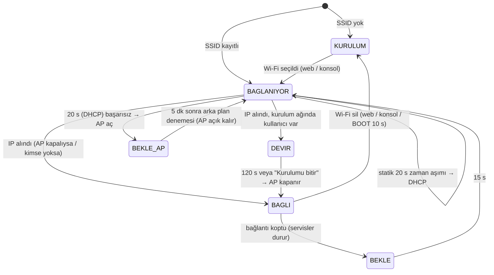

# Ağ Bağlantısı ve AP Kurulumu

Durum: DESIGN DECISION (D-23, D-24) · 25.09.2026 · uygulandı (F2.2; kurulum/kurtarma deneyimi F2.3). Davranış SCADA cihaz ailesiyle aynıdır (4chRelayModule `network.h`, Flowmeter ESP32 `startStationMode`/`startAPMode`) ve `scada-device-baseline` §5 “Ağ bağlantı yaşam döngüsü” yeteneğine karşılık gelir.

Çekirdek mantık `lib/core/src/cc_netfsm.*` (saf, native testli), platform uygulaması `src/app/net_manager.*`, HTTP `src/app/web.*`. Ağ durumu proses çıkışlarını hiçbir koşulda değiştirmez: kurulum, bağlantı kopması ve yeniden deneme sırasında kontrol ve güvenlik çalışmaya devam eder.

## 1. Durumlar

| Durum | Radyo | Servisler |
|---|---|---|
| KURULUM (`AP_ONLY`) | AP + STA (STA boşta) | Web, captive DNS |
| BAĞLANIYOR | STA (AP açıksa AP + STA) | Web |
| DEVİR (`ONLINE` + `handover`) | AP + STA; AP en çok 120 s açık | Web, captive DNS, mDNS, OTA, SNTP |
| BAĞLI (`ONLINE`) | STA; AP kapanır | Web, mDNS, OTA, SNTP |
| BEKLE / BEKLE_AP | STA boşta; AP açıksa kanal sabit | Web (AP'de captive) |

## 2. Sabitler

| Parametre | Değer | Kaynak |
|---|---|---|
| Kurulum ağı | `SCADA_AP_<chipId32 hex>` (ör. `SCADA_AP_3C71BF4A`) | Aile standardı |
| AP parolası | `12345678` (cihaz etiketine yazılır) | Aile standardı; bkz. §6 |
| AP adresi | `192.168.4.1/24`, captive DNS (her ad → 192.168.4.1) | Aile standardı |
| Bağlanma denemesi | 20 s | Aile standardı |
| Kopma sonrası bekleme | 15 s | 4chRelayModule |
| AP açıkken yeniden deneme | 5 dk | Aile standardı |
| Devir (bağlandıktan sonra AP'nin açık kalma süresi) | 120 s; “Kurulumu bitir” ile erken kapanır | D-24 |
| Statik IP başarısız | Aynı açılışta bir kez DHCP; bağlanınca uyarı + alınan adres | Aile standardı (US-01) |
| mDNS | `kulube-iklim.local` (ayarlanabilir) | CONFIGURATION_MODEL |
| NTP | `pool.ntp.org` + ağ geçidi (modem) | D-22 |

## 3. Kurulum ve kurtarma akışı (D-24, `scada-wifi-onboarding`)

İlkeler: **kaydedildi ≠ bağlandı** (başarı yalnız cihazın güncel verisiyle gösterilir), **yanıt yok ≠ işlem yapılmadı** (istek otomatik tekrarlanmaz), kopma nedeni cihazın bildirdiği sınıftır ve olasılık diliyle sunulur, süreler cihaz sayaçlarından gelir. Wi-Fi, saat eşitlemesi ve MQTT ayrı durumlardır.

1. **Kurulum ağına erişim** (etiket/başlangıç kartı): `SCADA_AP_<id>`, parola etikette, `http://192.168.4.1`. “Bu ağda internet olmaması normaldir.” Captive portal sayfayı açabilir; açmazsa adres elle yazılır (garanti edilmez).
2. **Başlangıç kartı** (Genel Bakış üstü): `net_setup` = `FIRST` → “Cihazınızı Wi-Fi ağına bağlayın”; `RECOVERY` → “Cihaz kayıtlı ağa bağlanamadı” + cihazın bildirdiği neden + sonraki arka plan denemesine kalan süre (`net_retry_s`) + **Kayıtlı ağı şimdi dene**; `HANDOVER` → bağlandı, adresler, **Kurulumu bitir**. “Kurulum ağına bağlı” rozeti yalnız sayfa 192.168.4.x üzerinden açıldıysa. **Cihaz panelini aç** kartı daraltır; kurulumu tamamlanmış saymaz.
3. **Ağ seçimi** (3 adımlı pencere: Ağ seç → Bilgiler → Bağlantı): “Yalnızca 2.4 GHz ağlar desteklenir” sabit bilgisi; tarama göstergesi; ağ satırı = ad, sinyal (ikon + metin), Parolalı/Açık, seçili onay işareti; boş liste, zaman aşımı, oturum ve iletişim kopması ayrı mesajlar. **Ağım görünmüyor**: yardım + gizli ağ için elle ad (UTF-8 1–32 bayt) ve “parola istiyor” seçimi.
4. **Bilgiler**: seçili ağ + **Başka ağ seç**; parolalı ağda göster/gizle düğmeli parola (8–63 bayt veya 64 onaltılık; kırpma yok, baş/son boşlukta uyarı), açık ağda “Bu ağ parola istemiyor”. Sabit IP etkinse bilgi notu. Kaydetmeden önce **“Kaydettiğinizde”** kutusu: ne olacağı, cihaz adresi (`http://<mdns>.local`), kurulum ağı adı ve adresi — bağlantı kesildiğinde de pencerede kalır. Birincil eylem **Kaydet ve bağlan** (yeniden başlatma yoktur).
5. **Bağlantı** (kalıcı kart, üç aşama): *Ayarlar kaydedildi* (HTTP 200) → *“X” ağına bağlanılıyor* (`net_try` > `net_try_base`, `net_result=TRYING`) → *Bağlantı cihazdan doğrulandı* (`net_result=CONNECTED` + `sta_ip`). Hata: 400 alan yanında, 401/403 oturum, 507 “kalıcı kayıt yapılamadı, önceki ağ korundu”. Yanıt yoksa “İşlem sonucu doğrulanamadı” + adresler + yardım; kayıt, cihaz verisi dönünce `net_try`/`wifi_ssid` ile doğrulanır.
6. **Başarı** (kurulum ağından): AP devir için açık kalır; sayfa “Cihaz Wi-Fi ağına bağlandı” + ağ, sinyal, saat eşitlemesi, MQTT, IP ve mDNS adresi (kopyala; güvenli bağlam yoksa seçilebilir metin) + kapanışa kalan süre (`ap_close_s`). **Kurulumu bitir** → `POST /api/net/finish` → yönergeler ve **Cihaz panelini aç** (`http://<sta_ip>/`). Kanal değişiminde telefon AP'den kısa süre kopabilir; sayfa sakin not gösterir ve veri dönünce sonucu alır.
7. **Başarısızlık**: “Cihaz ‘X’ ağına bağlanamadı” + neden sınıfı (§3.1) + “kurulum ağı açık kaldı, bilgiler cihazda, 5 dk'da bir yeniden denenir”; eylemler **Parolayı yeniden gir**, **Başka ağ seç**, **Şimdi yeniden dene**. Eski ağa otomatik dönüş yoktur ve vaat edilmez.
8. **Normal ağdan değişiklik** (Ayarlar › Bakım): aynı pencere; sayfa bağlantısı kesilir, genel “veri bayat” alarmı yerine “Ağ değişikliği sürüyor” notu; pencerede yeni adres ve kurulum ağına dönüş yönergesi. **Cihaza ulaşamıyorum** yardımı: doğru ağ, adres, router istemci listesi, kurulum ağı görünüyorsa 192.168.4.1, son çare BOOT 10 s.
9. **Sıfırlama kapsamları ayrı**: Yeniden başlat · Wi-Fi bilgilerini sil (onay metni kapsamı ve kurulum ağı adresini verir; sonrasında kalıcı yönerge) · Fabrika ayarları (F4). Bağlantı sorununda ilk öneri ağı değiştirmektir.

### 3.1 Kopma nedeni sınıfları (`net_fail`)

`WiFi.onEvent(STA_DISCONNECTED).reason` (ESP-IDF `wifi_err_reason_t`) → `cc::classifyWifiReason`; 8 (kendi ayrılmamız) yok sayılır; L2 bağlantı olup IP gelmediyse `NO_IP`.

| Sınıf | Kodlar | UI metni (olasılık dili) |
|---|---|---|
| `NOT_FOUND` | 201 | Ağ görülmedi: 5 GHz, kapsama dışı veya farklı ad olabilir |
| `AUTH` | 2, 14, 15, 23, 202, 204 | Ağ bağlantıyı doğrulamadı; en olası neden yanlış parola, zayıf sinyal de aynı sonucu verebilir |
| `ASSOC` | 17–21, 203 | Erişim noktası kabul etmedi (istemci sınırı, MAC filtresi, güvenlik ayarı) |
| `NO_IP` | L2 var, IP yok | DHCP; sabit IP etkinse ayarlar ağa uymuyor olabilir |
| `SIGNAL_LOST` | 200 | Erişim noktası sinyali kayboldu |
| `OTHER` / `NONE` | diğer / yok | “Bağlantı tamamlanamadı (kod N)” / “neden bildirilmedi” |

## 4. Arayüzler

### 4.1 HTTP (aile sözleşmesi)

| Uç | Yöntem | İçerik |
|---|---|---|
| `/scan` | GET | `{pending, networks:[{ssid, rssi, secure, channel}]}`; `pending` ise istemci ~700 ms aralıkla en çok 20 kez sorar |
| `/api/settings` | POST | `{ssid, pass}` yalnız kablosuz kimlik; `pass: ""` açık ağ; ana formda Ağ bölümü alanları (`adN, mdns, staticEnabled, staticIP, gateway, subnet, dns1, dns2`). Yanıt `{message, reconnect, net_try_base}` — yalnız kalıcı kaydı onaylar |
| `/api/net/retry` | POST | Kayıtlı ağı hemen dene → `{net_try_base}`; SSID yoksa 409 |
| `/api/net/finish` | POST | Devirdeki kurulum ağını kapat; devir yoksa 409 |
| `/api/settings` | GET | Ağ alanları + `ssid`, `passSet`, `otaPasswordSet`, `apName` (parola dönmez) |
| `/api/reset-wifi` | POST | Kimlik silinir, statik IP kapanır, yeniden başlatmadan AP açılır |
| `/api/data` | GET | `ap_mode, ap_name, ap_ip, wifi_ssid, wifi_ok, wifi_rssi, net_note, wifi_reconnects`; F2.3: `net_phase` (AP_ONLY/CONNECTING/ONLINE/WAITING), `net_setup` (NONE/FIRST/RECOVERY/HANDOVER), `net_try`, `net_result` (NONE/TRYING/CONNECTED/FAILED), `net_fail`, `net_fail_code`, `net_retry_s`, `ap_close_s`, `ap_clients`, `sta_ip`, `static_ip` |
| diğer | — | AP'de bilinmeyen her yol `302 → http://192.168.4.1/` (Android/iOS/Windows captive denetimleri) |

Yazma istekleri `X-SCADA: 1` başlığı ister. Oturum/parola F4'te; o zamana kadar UI “Web parolası tanımlı değil” uyarısını gösterir.

### 4.2 Seri konsol ve buton

| Yol | Etki |
|---|---|
| `wifi <ssid> [parola]` | Web ile aynı doğrulama ve yol (`net::apply`) |
| `wifi clear` | `/api/reset-wifi` ile aynı |
| `ntp <sunucu>` | NTP sunucusu |
| BOOT butonu 10 s | Wi-Fi silinir, kurulum AP'si açılır (SECURITY §2 kurtarma) |

### 4.3 OTA

ArduinoOTA yalnız bağlıyken ve OTA parolası tanımlıysa açılır (D-17). Parola konsoldan `otapass <parola>` (NVS'te yalnız MD5 özeti). Güvenli duruş: `ota` komutu çekirdeği `OTA_PREP`'e alır; ısıtma durup post-cool bitince `OTA` durumunda yükleme kabul edilir. Hazırlıksız başlayan yükleme iptal edilir ve hazırlık başlatılır. `platformio.ini` içinde espota parametreleri yorum satırı olarak durur.

## 5. Kalıcılık

Wi-Fi kimliği, Ağ bölümü alanları, NTP sunucusu ve OTA özeti NVS `net` ad alanındadır (F2.2). F3'te konfigürasyon deposuna (primary/backup/temp) taşınır; NVS kaydı göç için okunur.

## 6. Güvenlik notları

- AP parolası aile genelinde ortaktır ve etikette yazar; kurulum ağına erişen biri Wi-Fi seçebilir ve (F4'e kadar) komut gönderebilir. Proses güvenliği etkilenmez (safety limitleri uzaktan yazılamaz, R1/R2 doğrudan kumandası yok). F4'te web parolası tanımlıysa AP'de de oturum istenir. **OPEN ISSUE:** cihaza özgü AP parolası (etiket) aile standardına öneri olarak götürülecek.
- HTTP şifrelenmez (SECURITY §2). Wi-Fi parolası hiçbir GET yanıtında, olayda veya seri çıktıda yer almaz.

## 7. Testler

- Native `test/native/test_netfsm` (13 test): ilk açılış AP, kurulum → bağlantı → devir 120 s → AP kapanır, “Kurulumu bitir”, arka plan başarısında devir yalnız AP istemcisi varsa, başarısız denemede sonuç + neden sınıfı, neden kodu sınıflandırması, boot'ta ulaşılamayan ağ → 20 s AP + 5 dk deneme, statik → DHCP, geçersiz statik, kopma → 15 s → AP, Wi-Fi silme, `millis()` taşması, IPv4 doğrulaması.
- HIL: [HIL.md](HIL.md) H16–H22.
