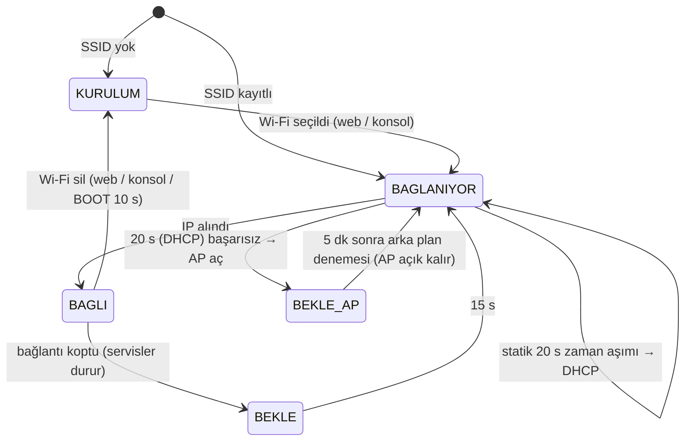

# Ağ Bağlantısı ve AP Kurulumu

Durum: DESIGN DECISION (D-23) · 25.09.2026 · uygulandı (F2.2). Davranış SCADA cihaz ailesiyle aynıdır (4chRelayModule `network.h`, Flowmeter ESP32 `startStationMode`/`startAPMode`) ve `scada-device-baseline` §5 “Ağ bağlantı yaşam döngüsü” yeteneğine karşılık gelir.

Çekirdek mantık `lib/core/src/cc_netfsm.*` (saf, native testli), platform uygulaması `src/app/net_manager.*`, HTTP `src/app/web.*`. Ağ durumu proses çıkışlarını hiçbir koşulda değiştirmez: kurulum, bağlantı kopması ve yeniden deneme sırasında kontrol ve güvenlik çalışmaya devam eder.

## 1. Durumlar

| Durum | Radyo | Servisler |
|---|---|---|
| KURULUM (`AP_ONLY`) | AP + STA (STA boşta) | Web, captive DNS |
| BAĞLANIYOR | STA (AP açıksa AP + STA) | Web |
| BAĞLI (`ONLINE`) | STA; AP kapanır | Web, mDNS, OTA, SNTP |
| BEKLE / BEKLE_AP | STA boşta; AP açıksa kanal sabit | Web (AP'de captive) |

## 2. Sabitler

| Parametre | Değer | Kaynak |
|---|---|---|
| Kurulum ağı | `SCADA_AP_<chipId32 hex>` (ör. `SCADA_AP_3C71BF4A`) | Aile standardı |
| AP parolası | `12345678` (cihaz etiketine yazılır) | Aile standardı; bkz. §6 |
| AP adresi | `192.168.4.1/24`, captive DNS (her ad → 192.168.4.1) | Aile standardı |
| Bağlanma denemesi | 20 s | Aile standardı |
| Kopma sonrası bekleme | 15 s | 4chRelayModule |
| AP açıkken yeniden deneme | 5 dk | Aile standardı |
| Statik IP başarısız | Aynı açılışta bir kez DHCP; bağlanınca uyarı + alınan adres | Aile standardı (US-01) |
| mDNS | `kulube-iklim.local` (ayarlanabilir) | CONFIGURATION_MODEL |
| NTP | `pool.ntp.org` + ağ geçidi (modem) | D-22 |

## 3. Kurulum akışı (ilk açılış)

1. Cihaz `SCADA_AP_…` ağını yayınlar; durum LED'i (boştayken) yavaş yanıp söner, olay günlüğünde `NET_AP_ON`.
2. Telefon ağa bağlanır; captive portal kurulum sayfasını açar (açmazsa `http://192.168.4.1`).
3. Genel Bakış'ın başında **AP · KURULUM MODU** paneli: kurulum ağı adı, adres, üç adım, **Wi-Fi seç ve bağlan**.
4. Wi-Fi diyaloğu `GET /scan` ile 2.4 GHz ağları listeler (aynı ad + güvenlik türü tek satır, en güçlü sinyal); ağ seçilir, parola girilir (açık ağ kutusu), **Ağı kaydet** → `POST /api/settings {ssid, pass}`.
5. Cihaz yeniden başlamadan AP + STA ile bağlanır; bağlanınca AP kapanır (`NET_AP_OFF`, `NET_CONNECTED`). Telefon normal ağa döner; cihaz `kulube-iklim.local` veya IP ile açılır.
6. Bağlanamazsa 20 s sonra AP yeniden yayında kalır, panel “‘X’ ağına bağlanılamadı” der ve kayıtlı ağ 5 dakikada bir denenir.

## 4. Arayüzler

### 4.1 HTTP (aile sözleşmesi)

| Uç | Yöntem | İçerik |
|---|---|---|
| `/scan` | GET | `{pending, networks:[{ssid, rssi, secure, channel}]}`; `pending` ise istemci ~700 ms aralıkla en çok 20 kez sorar |
| `/api/settings` | POST | `{ssid, pass}` yalnız kablosuz kimlik; `pass: ""` açık ağ; ana formda Ağ bölümü alanları (`adN, mdns, staticEnabled, staticIP, gateway, subnet, dns1, dns2`) |
| `/api/settings` | GET | Ağ alanları + `ssid`, `passSet`, `otaPasswordSet`, `apName` (parola dönmez) |
| `/api/reset-wifi` | POST | Kimlik silinir, statik IP kapanır, yeniden başlatmadan AP açılır |
| `/api/data` | GET | `ap_mode, ap_name, ap_ip, wifi_ssid, wifi_ok, wifi_rssi, net_note, wifi_reconnects` |
| diğer | — | AP'de bilinmeyen her yol `302 → http://192.168.4.1/` (Android/iOS/Windows captive denetimleri) |

Yazma istekleri `X-SCADA: 1` başlığı ister. Oturum/parola F4'te; o zamana kadar UI “Web parolası tanımlı değil” uyarısını gösterir.

### 4.2 Seri konsol ve buton

| Yol | Etki |
|---|---|
| `wifi <ssid> [parola]` | Web ile aynı doğrulama ve yol (`net::apply`) |
| `wifi clear` | `/api/reset-wifi` ile aynı |
| `ntp <sunucu>` | NTP sunucusu |
| BOOT butonu 10 s | Wi-Fi silinir, kurulum AP'si açılır (SECURITY §2 kurtarma) |

### 4.3 OTA

ArduinoOTA yalnız bağlıyken ve OTA parolası tanımlıysa açılır (D-17). Parola konsoldan `otapass <parola>` (NVS'te yalnız MD5 özeti). Güvenli duruş: `ota` komutu çekirdeği `OTA_PREP`'e alır; ısıtma durup post-cool bitince `OTA` durumunda yükleme kabul edilir. Hazırlıksız başlayan yükleme iptal edilir ve hazırlık başlatılır. `platformio.ini` içinde espota parametreleri yorum satırı olarak durur.

## 5. Kalıcılık

Wi-Fi kimliği, Ağ bölümü alanları, NTP sunucusu ve OTA özeti NVS `net` ad alanındadır (F2.2). F3'te konfigürasyon deposuna (primary/backup/temp) taşınır; NVS kaydı göç için okunur.

## 6. Güvenlik notları

- AP parolası aile genelinde ortaktır ve etikette yazar; kurulum ağına erişen biri Wi-Fi seçebilir ve (F4'e kadar) komut gönderebilir. Proses güvenliği etkilenmez (safety limitleri uzaktan yazılamaz, R1/R2 doğrudan kumandası yok). F4'te web parolası tanımlıysa AP'de de oturum istenir. **OPEN ISSUE:** cihaza özgü AP parolası (etiket) aile standardına öneri olarak götürülecek.
- HTTP şifrelenmez (SECURITY §2). Wi-Fi parolası hiçbir GET yanıtında, olayda veya seri çıktıda yer almaz.

## 7. Testler

- Native `test/native/test_netfsm` (9 test): ilk açılış AP, kurulum → bağlantı → AP kapanır, boot'ta ulaşılamayan ağ → 20 s AP + 5 dk deneme, statik → DHCP, geçersiz statik, kopma → 15 s → AP, Wi-Fi silme, `millis()` taşması, IPv4 doğrulaması.
- HIL: [HIL.md](HIL.md) H16–H22.
