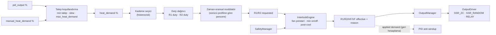

# Çıkışlar, Power Manager ve Interlock'lar

## 1. Katmanlar



PowerManager saf bir fonksiyondur: `(heat_demand, sürücü profili, zaman, önceki durum) → (r1_duty, r2_duty, r1_req, r2_req)`. GPIO görmez.

## 2. Strateji seçenekleri

| Seçenek | Nasıl | Artı | Eksi | Uygun sürücü |
|---|---|---|---|---|
| Sabit kademe (0/R1/R1+R2) | Talep eşikleri + histerezis | En az anahtarlama; mekanik röle dostu | Kaba çözünürlük; ±0.5–1 °C salınım | RELAY |
| Zaman-oransal (tek duty, iki rezistans aynı anda) | Pencere içinde R1+R2 birlikte %d | Basit | Tam güç darbeleri, yüksek flicker, gereksiz yüksek anlık güç | — |
| SSR duty (hızlı PWM) | Pencere 1–2 s | Yüksek çözünürlük | Zero-cross'ta pencere < 1 s anlamsız; EMI/flicker | SSR_ZC (sınırlı) |
| **Kademeli zaman-oransal (hibrit)** | 0–50 %: R1 modüle; 50–100 %: R1 tam + R2 modüle | İyi çözünürlük, düşük anlık güç, az flicker | Kademe sınırında histerezis gerekir | SSR_ZC, SSR_RANDOM |
| Kademeli + histerezis (röle hibriti) | Kademe seçimi histerezisli, yalnız üst kademe uzun pencereyle modüle | Röle ömrünü korur | Yavaş | RELAY |

**DESIGN DECISION:** Varsayılan strateji **kademeli zaman-oransal (hibrit)**; sürücü profili `RELAY` seçilirse otomatik olarak **sabit kademe + uzun pencere** davranışına geçer ([ADR-002](ADR/ADR-002-staged-time-proportional.md)).

## 3. Kademeli zaman-oransal eşleme

### 3.1 Eşit güç (varsayılan)

| heat_demand | Kademe | R1 duty | R2 duty |
|---|---|---|---|
| 0 % | 0 | 0 | 0 |
| 0 < d ≤ 50 % | 1 | 2·d | 0 |
| 50 < d < 100 % | 2 | 100 % | 2·(d − 50) |
| 100 % | 2 | 100 % | 100 % |

### 3.2 Kademe histerezisi

- Kademe 1 → 2: `d ≥ stage2_on` (varsayılan 55 %) ve kademe 1'de ≥ `stage_min_dwell_s` (120 s).
- Kademe 2 → 1: `d ≤ stage2_off` (varsayılan 45 %) ve kademe 2'de ≥ `stage_min_dwell_s`.
- Histerezis bandında (45–55 %) mevcut kademe korunur; güç sürekliliği için kademe 1'de R1 duty 100 %'e kıstırılır, fark bir sonraki pencerede kademe 2'ye aktarılır. Sonuç: bant içinde uygulanan güç talebi en çok ±5 % sapar; PID bunu `applied demand` geri beslemesiyle telafi eder.

### 3.3 Farklı güçte rezistanslar

`heater_power_w[R1]`, `heater_power_w[R2]` tanımlıysa: `P_total = P1 + P2`, istenen güç `d·P_total`. Kademe 1 kapasitesi `P1/P_total`; kademe sınırı ve duty'ler bu orana göre hesaplanır. Önce küçük rezistans modüle edilir (daha iyi çözünürlük) — `lead_heater` otomatik seçimi.

### 3.4 Lider/takipçi rotasyonu

**DESIGN DECISION:** Eşit güçte `lead_rotation` (varsayılan `DAILY`): lider rezistans her gün 00:00'da (saat geçerliyse; değilse her 24 sa çalışma) değişir; kademe 1 aktifse değişim bir sonraki talep 0 anında yapılır. Amaç çalışma saati ve anahtarlama eşitliği. `OFF` seçilebilir.

### 3.5 Pencere fazı

R1 ve R2 pencereleri yarım pencere kaydırılır; aynı anda iki büyük yükün devreye girmesi önlenir (flicker ve ani akım). **ASSUMPTION:** Şebeke flicker sınırları (IEC 61000-3-3) 2 × 2 kW ve 20 s pencere için elektrik tasarımcısı tarafından değerlendirilir.

## 4. Sürücü soyutlaması

`OutputDriver` mantıksal arayüzü (kod değil, sözleşme):

| İşlem / özellik | Anlam |
|---|---|
| `kind` | `SSR_ZC`, `SSR_RANDOM`, `RELAY`, `TRIAC_PHASE` (FUTURE), `NONE` |
| `set(on)` | Mantıksal seviye; polarite (`active_high`) sürücü içinde |
| `min_on_ms`, `min_off_ms`, `window_s`, `min_pulse_ms` | Profil sınırları |
| `feedback()` | `UNKNOWN` (v1) / `ON` / `OFF` / `FAULT` — geri bildirim modülü varsa |
| `switch_count`, `on_time_s` | Kalıcı sayaçlar (OutputManager tutar) |

### 4.1 Sürücü profilleri (başlangıç değerleri)

| Profil | Pencere | Min ON | Min OFF | Min darbe | Azami anahtarlama | Not |
|---|---|---|---|---|---|---|
| `SSR_ZC` (sıfır geçişli) | 20 s | 1 s | 1 s | 1 s (50 Hz'de 50 periyot → %5 çözünürlük) | ≈ 180/sa/kanal | Isı dağıtımı (soğutucu) zorunlu; kaçak akım nedeniyle "OFF" durumda da gerilim ölçülebilir |
| `SSR_RANDOM` | 20 s | 1 s | 1 s | 1 s | ≈ 180/sa | Rezistif yükte ZC tercih edilir; EMI daha yüksek |
| `RELAY` (mekanik/kontaktör) | 600 s | 120 s | 180 s | 120 s | ≤ 6/sa/kanal | Ömür hesabı §4.2; kademe histerezisi zorunlu |
| `TRIAC_PHASE` | — | — | — | — | — | FUTURE: faz açısı kontrol; rezistans için EMI/harmonik nedeniyle önerilmez |

### 4.2 Röle ömrü etkisi

**ASSUMPTION:** Rezistif yükte tipik kontaktör/röle elektriksel ömrü 100 000 anahtarlama (üretici verisiyle doğrulanmalı).

| Senaryo | Çevrim/gün | Ömür (yıl) |
|---|---|---|
| 20 s pencere röle ile (yanlış yapılandırma) | 4320 | 0.06 |
| 600 s pencere, sürekli modülasyon | 144 | ≈ 1.9 |
| Sabit kademe, min ON 5 dk / OFF 5 dk, ortalama 2 çevrim/sa | 48 | ≈ 5.7 |

**DESIGN DECISION:** `RELAY` profilinde pencere < 300 s ve min ON < 60 s değerleri konfigürasyon doğrulamasında reddedilir. `SSR_*` profillerinde pencere < 5 s reddedilir. `switch_count` preventive maintenance eşiği (`relay_life_cycles` %80) uyarı üretir.

### 4.3 Fan sürücüleri

Heater Fan ve Ventilation Fan için `RELAY` veya `SSR_ZC` (endüktif yük için uygun SSR tipi elektrik tasarımcısında). Fan min ON/OFF: 60 s / 30 s (Heater Fan'da güvenlik açılışı min OFF'u bekleyemez — §5 kural I-3).

## 5. Interlock motoru

### 5.1 Genel model

Her kontrol edilebilir çıkış `o` için her kontrol periyodunda ve her 100 ms'lik çıkış tikinde:

```text
requested(o)  = kaynağın isteği (controller, manual, service test)
effective(o)  = F(requested(o), interlock kuralları, safety durumu, zamanlayıcılar)
reason(o)     = effective ≠ requested ise en yüksek öncelikli kuralın kodu, aksi "NONE"
```

Kurallar sabit bir tabloda, öncelik sırasıyla değerlendirilir; bir kural bir çıkışı yalnız **zorlayabilir** (FORCE_ON / FORCE_OFF) veya **geciktirebilir** (HOLD). Tablo veri olarak tanımlanır; 3. rezistans veya soğutma çıkışı eklendiğinde kod değil tablo genişler.

### 5.2 Kural tablosu

| ID | Öncelik | Kural | Etki | `reason` |
|---|---|---|---|---|
| I-1 | 1 | Safety kilidi veya ARM=0 | R1, R2 FORCE_OFF | `SAFETY_LOCKOUT` / `OVERTEMPERATURE_LOCKOUT` / `SENSOR_FAULT` / `OTA` |
| I-2 | 2 | `R1_eff ∨ R2_eff ∨ post_cool_active ∨ prepurge` | HF FORCE_ON | `HEATER_INTERLOCK` / `POST_COOL` / `PREPURGE` |
| I-3 | 3 | HF_eff = ON değil veya ON süresi < `fan_prestart_s` | R1, R2 HOLD (OFF) | `FAN_PRESTART` |
| I-4 | 4 | Safety OVERTEMP | VF FORCE_ON | `OVERTEMPERATURE` |
| I-5 | 5 | Antifreeze aktif | VF FORCE_OFF | `ANTIFREEZE_INHIBIT` |
| I-6 | 6 | Isıtma/vent koordinasyonu ([CONTROL_ARCHITECTURE §5](CONTROL_ARCHITECTURE.md)) | VF FORCE_OFF veya talep sınırı | `HEATING_PRIORITY` / `VENT_PRIORITY` |
| I-7 | 7 | Min ON süresi dolmadı (güvenlik kapatması hariç) | HOLD (ON) | `MIN_ON_TIME` |
| I-8 | 8 | Min OFF süresi dolmadı (güvenlik açılışı hariç: I-2, I-4) | HOLD (OFF) | `MIN_OFF_TIME` |
| I-9 | 9 | Changeover gecikmesi (ısıtma ↔ vent) | HOLD | `CHANGEOVER_DELAY` |
| I-10 | 10 | Yerel kilit / uzak komut reddi | istek değişmez | `LOCAL_LOCK` |
| I-11 | 11 | SERVICE modu dışında R1/R2 doğrudan istek | yok sayılır | `SERVICE_ONLY` |

**Değişmez (property):** Hiçbir durum dizisinde `(R1_eff ∨ R2_eff) ∧ ¬HF_eff` oluşamaz. OutputManager GPIO'ları her tikte **sıralı** uygular: açılışta önce HF, sonra (prestart sonrası) R; kapanışta önce R, sonra (post-cool sonrası) HF. Aynı tikte hem R açılışı hem HF kapanışı üretilemez; bu kontrol OutputManager'da ikinci kez yapılır (savunma derinliği).

### 5.3 Requested / effective örnekleri

| Senaryo | requested | effective | reason |
|---|---|---|---|
| Kullanıcı R1 aktifken Heater Fan OFF ister | HF=OFF | HF=ON | `HEATER_INTERLOCK` |
| Rezistanslar kapandı, 40 s geçti | HF=OFF | HF=ON | `POST_COOL` |
| Aşırı sıcaklık, kullanıcı vent OFF | VF=OFF | VF=ON | `OVERTEMPERATURE` |
| Donma koruması, kullanıcı vent ON | VF=ON | VF=OFF | `ANTIFREEZE_INHIBIT` |
| Servis testi R1=ON, sensör arızası | R1=ON | R1=OFF | `SENSOR_FAULT` |
| Talep düştü, R1 90 s önce açıldı (röle) | R1=OFF | R1=ON | `MIN_ON_TIME` |

## 6. Post-cool

| Yöntem | Koşul | Varsayılan |
|---|---|---|
| `TIME` | R1 ve R2 OFF olduktan sonra `post_cool_seconds` | 60 s (30–600) |
| `TEMPERATURE` (T2 gerekli) | `T2 < post_cool_safe_temp` (40 °C) **ve** en az `post_cool_min_s` (20 s); en çok `post_cool_max_s` (600 s) — max aşılırsa `POST_COOL_TIMEOUT` uyarısı ve fan çalışmaya devam eder (**DESIGN DECISION:** güvenli yön fan açık) | T2 yoksa `TIME` |
| `HYBRID` | Her iki koşul (TIME ∧ T2) | T2 varsa önerilen |

- Post-cool, FAILSAFE, OVERTEMP ve OTA_PREP dahil her kapanışta uygulanır.
- Post-cool sırasında yeni talep gelirse prepurge beklenmeden H_ACTIVE'e dönülür (fan zaten açık).
- Güç kesintisi sonrası boot'ta son kapanıştan post-cool bilgisi kalıcı değildir. **DESIGN DECISION:** Boot'ta son reset nedeni `WATCHDOG`/`PANIC`/`BROWNOUT` ve reset öncesi (RTC belleğinde tutulan) `heater_was_on` bayrağı set ise, boot sonrası Heater Fan `post_cool_seconds` çalıştırılır (`reason=BOOT_POST_COOL`).

## 7. Manuel fan istekleri

| Entity | Anlam |
|---|---|
| `heater_fan_manual` (switch) | Operatörün Heater Fan'ı ısıtma olmadan da çalıştırma isteği (ör. hava karıştırma). OFF isteği interlock'u geçemez. |
| `ventilation_fan_manual` (switch) | Operatör havalandırma isteği; koordinasyon ve antifreeze kurallarına tabi, `manual_vent_timeout_min` sonra kendiliğinden OFF |

Switch entity'lerinin state değeri **istek**tir (Suite 8 s doğrulaması isteğin kabulünü doğrular); etkin durum `*_active` binary_sensor ve `*_reason` sensöründedir ([ADR-003](ADR/ADR-003-requested-effective-model.md)).

## 8. R1/R2 doğrudan kontrol neden yalnız Service modunda?

1. Rezistans bir **güç** çıkışıdır; doğrudan ON bırakılması kontrol döngüsünü devre dışı bırakır ve aşırı ısınmayı yalnız Safety sınırlarına bırakır.
2. Uzak (MQTT) doğrudan kumanda, Programs/Kurallar'ın yanlış yapılandırılmasıyla saatlerce ısıtma riskini doğurur; Suite'in 8 s doğrulaması fiziksel sonucu kanıtlamaz.
3. Normal kullanıcı ihtiyacı "daha sıcak" dır; bunu setpoint/BOOST/MANUAL talep güvenli biçimde karşılar.
4. Servis testinin amacı sürücü doğrulamasıdır; süre sınırı (`service_test_max_s` 120 s), interlock'lar ve yerel fiziksel varlık bu amaç için yeterli ve denetlenebilir çerçevedir.

Service modunda R1/R2 test isteği: tek seferde tek rezistans, `service_test_max_s` sonunda otomatik OFF, HF zorunlu, Safety sınırları aktif, olay günlüğüne `LOCAL_SERVICE` kaynaklı yazım.
