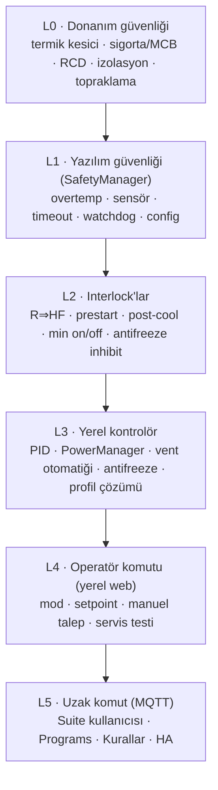

# Güvenlik Tasarımı

## 1. İlke

Safety Manager kontrol algoritmasından **bağımsız, üstün yetkili** bir katmandır: ayrı görevde, daha yüksek öncelikte çalışır; kendi ölçüm kalitesi değerlendirmesini ve kendi limitlerini kullanır; PID çıktısına, mod seçimine veya komut kaynağına bakmadan çıkışları güvenli yöne zorlayabilir. Yazılım güvenliği, donanım güvenliğinin **tamamlayıcısıdır; yerine geçmez.**

## 2. Güvenlik öncelik matrisi

| Seviye | Gerekçe | Neyi geçersiz kılar | Neyi yapamaz |
|---|---|---|---|
| L0 Donanım | Yazılım hatası, MCU donması, takılı SSR (kısa devre arızası SSR'nin tipik arıza modudur) karşısında tek bağımsız bariyer | Her şeyi (fiziksel kesme) | — |
| L1 Yazılım güvenliği | Ölçülebilir tehlikeli koşulları algılar; kontrol hatasından bağımsız | L2–L5 | Donanım arızasını gideremez; çıkış açamaz (VF hariç, OVERTEMP'te tahliye) |
| L2 Interlock | Ekipmanın güvenli çalışma koşulları (fan olmadan rezistans yok) | L3–L5 | L1 kararını geri alamaz |
| L3 Yerel kontrolör | Operatörün niyetini güvenli çıkışlara çevirir; ağdan bağımsız | L4–L5 isteklerini **yorumlar** (doğrudan çıkış sürdürmez) | Interlock ihlali |
| L4 Yerel operatör | Fiziksel yakınlık, kimlik doğrulanmış oturum | L5 (yerel kilit ile) | Kontrolörü atlayıp çıkış sürmek (servis testi hariç, o da L2 altında) |
| L5 Uzak | Otomasyon ve uzaktan erişim; yanlış yapılandırma olasılığı en yüksek | — | Servis işlemleri (varsayılan), konfigürasyon (varsayılan kapalı) |

"Yerel kontrolör, operatör komutunun üstündedir" ifadesi, komutların çıkışı değil **hedefi** değiştirdiği anlamına gelir: operatör setpoint'i 30 °C yapabilir ama rezistansı kontrolör + interlock + safety zinciri sürer.

## 3. Algılanan koşullar

| # | Koşul | Algılama (başlangıç değerleri) | Eylem | Kilit | Alarm |
|---|---|---|---|---|---|
| S1 | Ortam aşırı sıcaklık | T1 ≥ `cabin_overtemp_limit` (40 °C) 10 s | R OFF, VF FORCED, post-cool | Evet (T1 < limit − 3 °C ∧ reset) | `OVERTEMPERATURE` CRITICAL |
| S2 | Hava çıkışı aşırı sıcaklık (T2 varsa) | T2 ≥ `heater_outlet_limit` (80 °C) 3 s | R OFF, HF ON | Evet | `OVERTEMPERATURE` CRITICAL (`source=T2`) |
| S3 | Sensör yok | Sürücü init/okuma hatası 3 ardışık | R OFF | Oto (30 s GOOD) | `SENSOR_FAULT` CRITICAL |
| S4 | Sensör bayat | Son GOOD örnek yaşı > `sensor_stale_s` (10 s) | R OFF | Oto | `SENSOR_STALE` CRITICAL |
| S5 | Aralıklı sensör hatası | Son 10 dk'da hata oranı > 20 % | Kontrol sürer | Hayır | `SENSOR_FAULT` WARNING (`intermittent`) |
| S6 | Heater Fan arızası | T2 varsa: HF ON + R ON iken T2 yükselişi > `hf_fault_rise` (15 °C/dk) veya fan geri bildirimi FAULT | R OFF | Evet | `HEATER_FAN_FAULT` CRITICAL |
| S7 | Aşırı ısıtma süresi | Talep etkin üst sınırda (doyumda) kesintisiz > `max_continuous_heating_min` (240 dk) — onaylı yorum 25.09.2026 | R OFF | Evet | `HEATING_TIMEOUT` CRITICAL |
| S8 | Isıtmaya rağmen artış yok | HPM §6 | Uyarı | Hayır | `HEATING_PERFORMANCE_LOW` WARNING |
| S9 | Beklenmeyen sıcaklık artışı | R OFF iken T1 artışı > `unexpected_rise_c_per_10min` (1.5 °C) veya R ON iken > `max_rise_c_per_10min` (5 °C) | R OFF ikinci durumda | İkinci durumda evet | `UNEXPECTED_TEMPERATURE_RISE` WARNING / CRITICAL |
| S10 | Çıkış takılı | Geri bildirim varsa: komut ≠ geri bildirim > 5 s; yoksa dolaylı: R OFF iken S9 | ARM=0 | Evet | `OUTPUT_FAULT` CRITICAL |
| S11 | MCU watchdog | Boot'ta reset nedeni TWDT/IWDT/PANIC | Self-test; tekrar sayısı | Fırtınada evet | `WATCHDOG_RESET` WARNING |
| S12 | Boot/reboot | Her boot | Güvenli başlangıç | — | `DEVICE_BOOT` INFO olayı |
| S13 | Konfigürasyon bozulması | Şema/bütünlük/ilişki hatası | Son geçerli kopya; yoksa güvenli varsayılan + ısıtma kilitli | Oto | `CONFIGURATION_ERROR` CRITICAL |
| S14 | Aşırı yeniden başlatma | `faultBoots ≥ 5` / 30 dk | RECOVERY | Evet (yerel onay) | `RESTART_STORM` CRITICAL |
| S15 | MQTT hatası | Bağlantı yok > 60 s | **Kontrol etkilenmez** | Hayır | `MQTT_OFFLINE` WARNING |
| S16 | Wi-Fi hatası | Bağlantı yok > 60 s | **Kontrol etkilenmez** | Hayır | `WIFI_OFFLINE` WARNING |
| S17 | İç yazılım hatası | Görev heartbeat kaybı, kuyruk taşması, iç tutarlılık (ör. R ON ∧ HF OFF gözlemi) | R OFF, ARM=0 | Evet (reboot) | `INTERNAL_FAULT` CRITICAL |
| S18 | Saat geçersiz | NTP/RTC yok | Zaman tabanlı özellikler (rotasyon, günlük geçmiş) durur | Hayır | `TIME_INVALID` INFO |
| S19 | Donma riski, sensör arızası | T1 son GOOD değeri < `frost_guard_temperature` + 2 ∧ S3/S4 | Isıtma yok (ölçümsüz ısıtma yapılmaz) | — | `FROST_RISK_NO_SENSOR` CRITICAL |

- **DESIGN DECISION:** Safety limitleri (S1, S2, S7) kontrol limitlerinden ayrı konfigürasyon grubundadır, varsayılan olarak yalnız yerel web'den ve yönetici rolüyle değiştirilebilir, `remote writable = hayır`.
- **DESIGN DECISION:** `cabin_overtemp_limit ≥ ventilation_start_temperature + 5 °C` ve `≥ setpoint_boost + 10 °C` doğrulaması zorunludur ([CONFIGURATION_MODEL §4](CONFIGURATION_MODEL.md)).
- Safety kararları kendi filtrelenmemiş-ama-doğrulanmış ölçümünü kullanır (EMA gecikmesi yok, medyan-3 var).

## 4. Failsafe çıkış davranışı

| Durum | R1/R2 | Heater Fan | Ventilation Fan | Gerekçe |
|---|---|---|---|---|
| Sensör kullanılamaz | OFF | Post-cool, sonra manuel isteğe göre | Manuel istek korunur, otomatik durur | Ölçümsüz ısıtma yok; fan zararsız |
| MCU reboot | OFF (donanım pull-down) | Boot'ta `heater_was_on` ise post-cool | OFF → normal kurallar | Donanım seviyesinde güvenli |
| Watchdog reset | OFF | Boot post-cool | OFF → normal | Aynı |
| Konfigürasyon geçersiz | OFF (kilitli) | Post-cool | Manuel izinli | Limitler güvenilmez |
| Firmware fault (heartbeat) | OFF, ARM=0 | Post-cool (OutputTask canlıysa) | Değişmez | Kontrol güvenilmez |
| MQTT kesik | **Normal kontrol** | Normal | Normal | Yerel otonomi |
| Wi-Fi kesik | **Normal kontrol** | Normal | Normal | Yerel otonomi |
| Aşırı sıcaklık | OFF (kilit) | Post-cool | **ON (zorunlu)** | Tahliye |
| OTA | OFF, ARM=0 | Post-cool tamamlandıktan sonra OFF | `ota_vent_state` (varsayılan: son otomatik) | Yazım sırasında proses bekler |

**ASSUMPTION:** OutputTask'ın kendisi donarsa post-cool yazılımla sağlanamaz; bu durumda rezistans ARM/dinamik sinyal ile donanımda kesilir ve kalan ısı termik kesici + rezistans tasarımıyla sınırlanır (L0). Heater Fan'ın arıza anında çalışmaya devam etmesi gerekiyorsa fan için "normalde kapalı olmayan" (fail-on) bir donanım seçeneği elektrik tasarımında değerlendirilmelidir (**OPEN ISSUE**).

## 5. Donanımsal güvenlik sınırı

Firmware'in sorumluluğu **§3'teki koşulları algılamak ve sürme sinyallerini kesmek**le biter. Aşağıdakiler firmware kapsamı dışındadır ve cihazın güvenli sayılabilmesi için **zorunludur**; bu belge şebeke bağlantı talimatı vermez, yalnız gereksinim koyar.

| Gereksinim | Amaç |
|---|---|
| Her rezistans için bağımsız **termik kesici / thermal cutoff** (kendiliğinden resetlenmeyen tercih edilir), sürücüden bağımsız seri devrede | SSR kısa devre arızası veya MCU donmasında aşırı ısınmayı sınırlar |
| Uygun anma değerli **sigorta / MCB** ve kaçak akım koruması (RCD) | Aşırı akım ve kaçak akım |
| Yük akımına ve gerilimine uygun anma değerli **SSR/röle** (soğutucu, derating) | Sürücü aşırı ısınması |
| MCU tarafı ile şebeke arasında **galvanik izolasyon** (optokuplör/SSR girişi), yeterli creepage/clearance | Kullanıcı ve elektronik güvenliği |
| Uygun IP sınıfında, ısıya dayanıklı **muhafaza** | Toz, nem, yangın yayılması |
| **Koruyucu topraklama (PE)** tüm metal gövdelerde | Elektrik çarpması |
| Doğru kesitte kablo, uygun klemens, gerilim giderici | Gevşek bağlantı kaynaklı ısınma |
| Rezistans ve fan arasında fiziksel tasarım: fan durduğunda rezistansın yüzey sıcaklığı yangın riski oluşturmamalı | Fan arızasında bile güvenli arıza |
| Kurulum ve muayene yetkin elektrikçi tarafından, yerel yönetmeliklere uygun | Yasal ve fiili güvenlik |

**DESIGN DECISION:** Web UI "Hakkında/Güvenlik" panelinde ve README'de "Bu cihazın yazılım korumaları bağımsız donanım korumalarının yerine geçmez" uyarısı bulunur.

## 6. Heating Performance Monitor (HPM)

HPM kontrolü değiştirmez; gözlemler, uyarır ve preventive maintenance verisi üretir. Safety yalnız S9 ikinci durumu gibi açık tehlikede devreye girer.

### 6.1 Ölçülen büyüklükler

| Metrik | Tanım | Yayın |
|---|---|---|
| `temperature_rate` | T1 eğimi, 10 dk kayan doğrusal regresyon, °C/sa | `B/state` |
| `heating_efficiency_index` | `ΔT1 / (Σ(heat_demand·dt) / 100)` — tam güç eşdeğeri dakika başına °C, yalnız ısıtma dönemlerinde, dış etkiler dahil | `B/diag/state` |
| `duty_cycle_1h`, `duty_cycle_24h` | Ortalama heat_demand | diag |
| `heating_cycles_1h` | H_IDLE → H_ACTIVE geçiş sayısı | diag |
| `heating_minutes_today` | Günlük ısıtma süresi | diag + günlük geçmiş |
| `stage2_ratio_24h` | Kademe 2 süresi / ısıtma süresi | diag |

### 6.2 Kurallar (başlangıç eşikleri)

| Kod | Koşul | Önem |
|---|---|---|
| `HEATING_PERFORMANCE_LOW` | heat_demand ≥ 80 % ∧ süre ≥ 10 dk ∧ T1 artışı < 0.2 °C ∧ T1 < SP − 1 | WARNING |
| `UNEXPECTED_TEMPERATURE_RISE` | S9 | WARNING / CRITICAL |
| `EXCESSIVE_DUTY` | `duty_cycle_24h` > 85 % | INFO (kapasite yetersizliği göstergesi) |
| `LONG_HEATING_DURATION` | Tek ısıtma periyodu > 120 dk (S7'nin yarısı, uyarı) | WARNING |
| `FREQUENT_CYCLING` | `heating_cycles_1h` > 6 (röle profilinde > 3) | WARNING (PID ayarı / histerezis) |
| `CAPACITY_DEGRADATION` | `heating_efficiency_index` 7 günlük medyanı, ilk 14 günlük referansa göre %30 düşük (saat geçerli ve dış sıcaklık yoksa yalnız bilgi) | INFO |

**ASSUMPTION:** Dış sıcaklık sensörü olmadan verim düşüşü mevsim etkisiyle karışır; `CAPACITY_DEGRADATION` v1'de yalnız bilgi amaçlıdır. Dış sıcaklık ve akım ölçümü eklendiğinde güvenilir göstergeye dönüşür (EXPANSION_ROADMAP).

### 6.3 Preventive maintenance ilişkisi

HPM metrikleri + çalışma saatleri + anahtarlama sayaçları ([DIAGNOSTICS.md](DIAGNOSTICS.md)) Suite historian'da uzun dönem trend için yayınlanır. Cihaz karar vermez; Suite alarm kuralları (`TICARI_CEKIRDEK.md` high/low kuralları) bakım eşiklerini uygular.

## 7. Güvenlik doğrulama planı (implementasyon aşaması)

- Native: interlock değişmezi için özellik tabanlı test (rastgele komut dizileri × zaman), safety tetik tablosunun her satırı, failsafe tablosu.
- HIL: sensör kablosu çekme, sensör sabit değere takılma (stale), SSR girişinin elle zorlanması, OutputTask dondurma kancası, güç kesme sırasında rezistans açık.
- Saha: gerçek termik kesici tetik sıcaklığı, fan durdurulmuş rezistans yüzey sıcaklığı (elektrik tasarımcısının sorumluluğunda).
