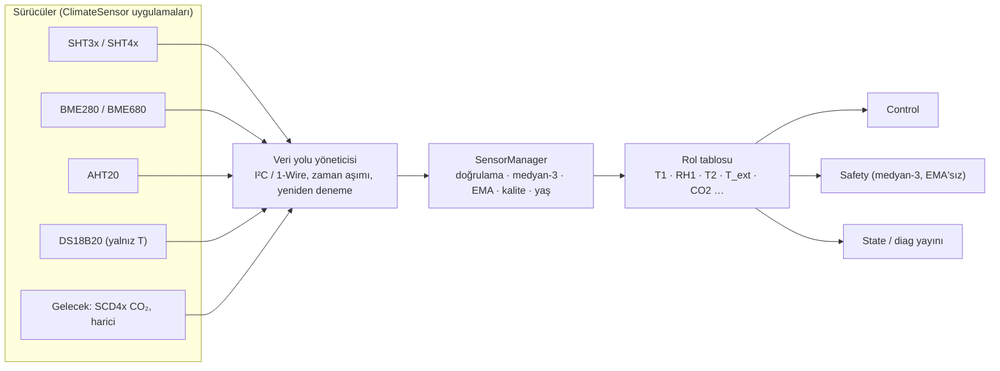

# Sensör Mimarisi

## 1. Hedef

Firmware belirli bir sensör ailesine bağlı olmaz. Kontrol ve Safety katmanları yalnız **mantıksal ölçüm rolleri** (T1, RH1, T2 …) ve bunların kalite/yaş bilgisini görür. Fiziksel sensör, rol eşlemesi ve kalibrasyon konfigürasyondur.

## 2. `ClimateSensor` mantıksal arayüzü

Sözleşme (implementasyon dili bağımsız):

| Üye | Dönüş | Anlam |
|---|---|---|
| `capabilities()` | küme: `TEMPERATURE`, `HUMIDITY`, `PRESSURE`, `GAS`, `CO2` | Rol eşlemesinde doğrulama |
| `begin()` | `OK` / `MISSING` / `BUS_ERROR` | Var/yok tespiti **gerçek yanıtla** (ACK + kimlik/seri no okuma) |
| `startMeasurement()` | durum | Dönüşümü başlatır (bloklamaz) |
| `poll()` | `PENDING` / `READY` / `ERROR` | Dönüşüm bitti mi (DS18B20 750 ms, SHT4x ≈ 10 ms) |
| `readTemperature()` | `{value °C, status}` | Ham değer, dönüşüm sonrası |
| `readHumidity()` | `{value %RH, status}` | Yetenek yoksa `UNSUPPORTED` |
| `status()` | `OK`, `MISSING`, `TIMEOUT`, `CRC_ERROR`, `BUS_ERROR`, `NOT_READY` | Son işlemin durumu |
| `quality()` | `GOOD`, `UNCERTAIN`, `BAD` | Sürücü seviyesi (ör. BME680 ısınma dönemi `UNCERTAIN`) |
| `timestamp()` | monoton ms | Son geçerli okuma zamanı |
| `identity()` | model, adres, seri no | Tanı ve rol doğrulama |
| `resetBus()` | durum | Kurtarma (I²C clock-stretch/kilit) |

**DESIGN DECISION:** Okuma asenkron (başlat → yokla → oku); SensorTask hiçbir sensörde bloklayıcı bekleme yapmaz. Veri yolu zaman aşımı 50 ms.

## 3. Sürücü kataloğu (değerlendirme)

| Sensör | Ölçüm | Arabirim | CRC | Artı | Dikkat |
|---|---|---|---|---|---|
| SHT40/41 | T, RH | I²C | Evet | Yüksek doğruluk, düşük öz ısınma, ısıtıcı ile yoğuşma temizleme | Isıtıcı kullanımı ölçümü bozar; kullanılırsa `UNCERTAIN` |
| SHT31 | T, RH | I²C | Evet | Olgun, alarm pini | |
| BME280 | T, RH, P | I²C/SPI | Hayır | Basınç bonusu | CRC yok → makullük kontrolüne dayanılır; öz ısınma (forced mode kullan) |
| BME680 | T, RH, P, gaz | I²C/SPI | Hayır | VOC eğilimi | Gaz ısıtıcısı T'yi yükseltir; BSEC lisansı/karmaşıklık; ısınma dönemi |
| AHT20 | T, RH | I²C | Evet (CRC8) | Ucuz | Kalibrasyon bitini kontrol et |
| DHT22 / AM2302 | T, RH | Tek hat (özel) | Checksum (8 bit toplam) | Ucuz, uzun kablo (≤ 20 m), **v1 seçimi** | Örnekleme ≥ 2 s; ±0.5 °C, ±2–5 % RH; zamanlama kritik → RMT ile yakalama; kimlik/seri no yok (var/yok yalnız yanıtla) |
| DS18B20 | T | 1-Wire | Evet | Uzun kablo, T2 için uygun, su geçirmez prob | Nem yok → ayrı RH sensörü; 85.0 °C güç-açılış değeri geçersiz sayılır |

**KARAR (25.09.2026, D-22):** T1+RH1 için DHT22/AM2302 (GPIO4); T2 v1'de yok. Çözücü `lib/core/src/cc_dht.*` (native testli), yakalama `src/app/hal_dht22.*`. SHT4x ve DS18B20 T2 genişleme seçeneği olarak kalır.

## 4. Doğrulama ve kalite modeli

### 4.1 Örnek bazında kontroller

| Kontrol | T1 | RH1 | T2 | Sonuç |
|---|---|---|---|---|
| Sürücü durumu `OK` | ✓ | ✓ | ✓ | aksi `BAD` |
| CRC | varsa | varsa | ✓ | hata → örnek atılır, `crc_errors++` |
| Fiziksel aralık | −40…+85 °C | 0…100 % | −40…+150 °C | dışında `BAD` (`out_of_range`) |
| Makul aralık (proses) | −30…+60 °C | 1…99.9 % | −30…+130 °C | dışında `UNCERTAIN` (`implausible`) |
| Değişim hızı | ≤ 2 °C/s | ≤ 10 %/s | ≤ 10 °C/s | aşarsa `UNCERTAIN`, medyan-3 ile elenir |
| Bilinen sahte değerler | — | — | 85.0 °C (DS18B20 reset), −127 °C | `BAD` |
| Sabit değer (takılı) | Aynı ham değer > `stuck_s` (1800 s) ve ısıtma aktif | aynı | aynı | `UNCERTAIN` + `SENSOR_STUCK` uyarısı |

### 4.2 Rol kalitesi

| Kalite | Tanım | Kontrol kullanımı | Safety kullanımı |
|---|---|---|---|
| `GOOD` | Son örnek geçerli, yaş ≤ 3 × örnekleme aralığı | Evet | Evet |
| `UNCERTAIN` | Makullük/hız şüphesi, ısınma dönemi | Son GOOD değer tutulur, en çok `sensor_stale_s` | Evet (tutucu yön) |
| `STALE` | Yaş > `sensor_stale_s` (10 s) | Hayır → FAILSAFE | Trip |
| `BAD` | Sürücü hatası, aralık dışı | Hayır → FAILSAFE (3 ardışık) | Trip |
| `MISSING` | `begin()` başarısız | Hayır | Trip |
| `DISABLED` | Rol yapılandırılmadı (ör. T2 yok) | Rol kullanılmaz | — |

**DESIGN DECISION:** Geçersiz ölçüm asla 0 veya son değer olarak "geçerli gibi" yayınlanmaz. MQTT'de değer `null`, kalite ayrı alanda (`temperature_quality`). Web UI'da `—` + kalite rozeti.

### 4.3 Nem özel durumları

- RH > 100 veya < 0 → `BAD`; RH ≥ 99.5 sürekli (> 30 dk) → `UNCERTAIN` + `SENSOR_CONDENSATION` INFO (yoğuşma/ıslanma).
- Nem arızası ısıtmayı **durdurmaz** (**DESIGN DECISION**): nem yalnız havalandırma girdisidir; RH1 `BAD` ise nem tabanlı havalandırma kuralları devre dışı ve `SENSOR_FAULT` WARNING (`role=RH1`).

### 4.4 Aralıklı hata

Rol başına 10 dk kayan pencerede hata oranı; > 20 % → WARNING `intermittent`; > 50 % → ilgili rol `UNCERTAIN` sayılır. Veri yolu kilitlenmesinde `resetBus()` en çok 3 deneme / 5 dk; sonra `MISSING`.

## 5. Kalibrasyon

| Alan | Aralık | Not |
|---|---|---|
| `t1_offset` | −5…+5 °C | Tek nokta; referans termometreyle |
| `rh1_offset` | −10…+10 % | |
| `t2_offset` | −10…+10 °C | |
| `t1_gain` (FUTURE) | 0.9…1.1 | İki nokta kalibrasyon |

Kalibrasyon Service/Ayarlar › Sensörler'de; değişiklik olay günlüğüne yazılır, ham ve düzeltilmiş değer tanı ekranında birlikte gösterilir.

## 6. İkinci sıcaklık sensörü (T2) hazırlığı

| Rol | v1 | Kullanım |
|---|---|---|
| T1 Cabin Temperature | Zorunlu | Kontrol, Safety S1, HPM |
| RH1 Cabin Humidity | Zorunlu (aynı modül olabilir) | Havalandırma |
| T2 Heater / Air Outlet | İsteğe bağlı (`t2_enabled`) | Safety S2 (aşırı sıcaklık), S6 (fan arızası dolaylı), post-cool `TEMPERATURE`/`HYBRID`, hava akış izleme (`t2 − t1` delta) |
| T_ext (FUTURE) | — | HPM verim normalizasyonu, antifreeze öngörüsü |

- T2 yokken ilgili özellikler `DISABLED` ve UI'da "donanımda yok" olarak gösterilir; sahte veri üretilmez.
- T2 varken **hava akış göstergesi**: HF ON ∧ R ON iken `t2 − t1` 3 dk içinde beklenen banda (ör. 10–50 °C) girmeli; çok yüksek → fan zayıf/arızalı (`HEATER_FAN_FAULT` şüphesi), çok düşük → rezistans çalışmıyor (`HEATING_PERFORMANCE_LOW` desteği).

## 7. Sensör sağlığı yayını

| Alan | Topic | Anlam |
|---|---|---|
| `sensor_ok` | `B/state` | T1 ∧ RH1 kalitesi GOOD |
| `temperature_quality`, `humidity_quality`, `t2_quality` | `B/state` | Rol kalitesi (enum) |
| `sensor_age_s` | `B/state` | T1 son geçerli örnek yaşı |
| `sensor_model` | `B/diag/state` | ör. `SHT41@0x44` |
| `sensor_error_count`, `sensor_crc_errors`, `sensor_timeouts` | `B/diag/state` | Monoton sayaçlar (boot'tan beri + kalıcı toplam) |
| `sensor_error_rate_10m` | `B/diag/state` | % |

## 8. Yerleşim notları (donanım tasarımına girdi)

- T1/RH1, rezistans ve fan hava akışından uzak, duvar yüzeyinden aralıklı, güneş almayan noktada; muhafaza içinde MCU/regülatör ısısından yalıtılmış (öz ısınma +1–3 °C hatası yaygındır).
- T2 hava çıkışında, rezistansa doğrudan temas etmeden.
- Uzun I²C kablo önerilmez (> 1 m); gerekirse diferansiyel I²C tamponu veya 1-Wire/RS-485 tabanlı sensör.
