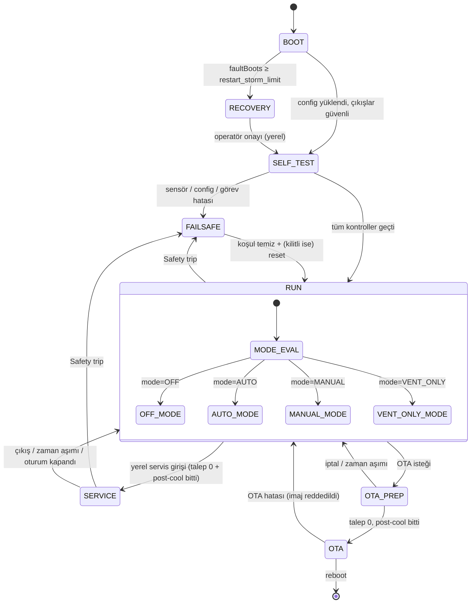
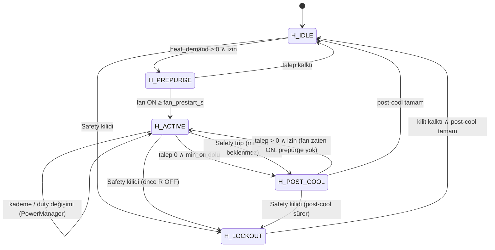
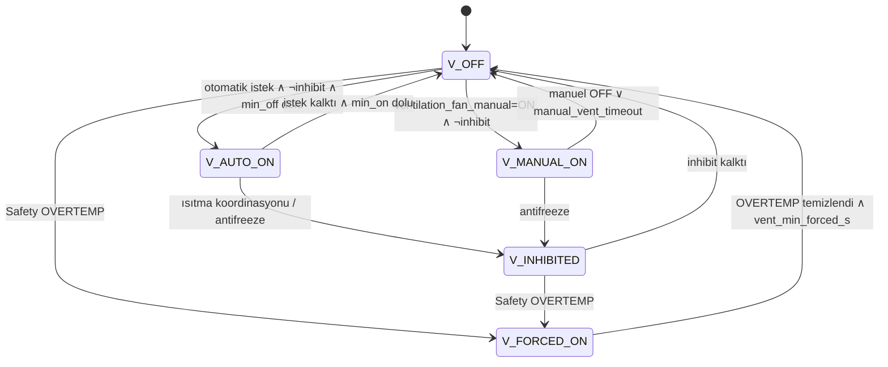

# Durum Makinesi

**DESIGN DECISION:** Tek düz durum makinesi yerine üç ortogonal makine + türetilmiş rapor durumu kullanılır. Isıtma zinciri (R1/R2/Heater Fan) ile havalandırma aynı anda farklı durumlarda olabilir (ör. POST_COOL sürerken nem nedeniyle havalandırma). Bunları tek makineye sıkıştırmak durum patlaması ve belirsiz öncelik üretir. Raporlanan tek `controller_state` deterministik bir öncelik tablosundan türetilir (§5).

## 1. Ana (sistem) makine

| Durum | Giriş eylemi | Çıkış koşulu | R1/R2 | Heater Fan | Vent |
|---|---|---|---|---|---|
| BOOT | GPIO LOW, ARM=0, config yükle | init bitti | OFF | OFF | OFF |
| SELF_TEST | Sensör 3 okuma, config doğrula, heartbeat, reset nedeni | geçti / kaldı | OFF | OFF | OFF |
| RECOVERY | Isıtma kilidi, CRITICAL alarm `RESTART_STORM` | yerel onay | OFF | Post-cool gerekirse | Manuel izinli |
| RUN | ARM=1 izni | Safety trip, servis, OTA | Isıtma makinesi | Isıtma makinesi | Vent makinesi |
| SERVICE | Talep 0, post-cool bekle; test izni | çıkış/timeout | Test (interlock altında) | Test/interlock | Test |
| FAILSAFE | Isıtma kilidi, ARM=0 (anında; fan yolu ARM'dan bağımsız), alarm | §4 | OFF | Post-cool sonra OFF | §4 kuralları |
| OTA_PREP | Yeni talep yok, post-cool | post-cool bitti (≤ 5 dk) | OFF | Post-cool | Config |
| OTA | Yazım | reboot / hata | OFF (ARM=0) | OFF | Config (`ota_vent_state`) |

## 2. Isıtma zinciri makinesi

| Durum | R1/R2 | Heater Fan | Çıkış koşulu |
|---|---|---|---|
| H_IDLE | OFF | OFF (manuel istek varsa ON) | Talep > 0 ve ısıtma izni |
| H_PREPURGE | OFF | ON | `fan_prestart_s` (3 s) doldu |
| H_ACTIVE | PowerManager | ON (zorunlu) | Talep 0 (min_on dolunca) / trip |
| H_POST_COOL | OFF | ON (zorunlu) | Zaman veya T2 kriteri ([OUTPUT_AND_INTERLOCKS §6](OUTPUT_AND_INTERLOCKS.md)) |
| H_LOCKOUT | OFF | Post-cool bitene kadar ON | Safety kilidi kalkar |

**Isıtma izni** = `RUN ∧ mode ∈ {AUTO, MANUAL} ∨ antifreeze` ∧ ¬Safety kilidi ∧ T1 kalitesi GOOD ∧ ¬vent koordinasyon inhibit.

Safety tripinde `min_on` beklenmez: güvenlik yönündeki kapatma minimum süre kurallarından üstündür (röle ömrü ikincildir).

## 3. Havalandırma makinesi

`V_INHIBITED` bir istek olduğu hâlde fanın kapalı tutulduğu durumdur; `ventilation_fan_effective=OFF`, `reason=HEATING_PRIORITY` veya `ANTIFREEZE_INHIBIT`.

Vent `min_on` / `min_off`: 60 s / 60 s (fan motoru ve röle koruması). `manual_vent_timeout_min` varsayılan 120 dk (0 = sınırsız).

## 4. FAILSAFE alt nedenleri ve çıkış davranışı

| `failsafe_reason` | Tetik | Kilit | Vent davranışı | Çıkış (dönüş) |
|---|---|---|---|---|
| `SENSOR_FAULT` | T1 eksik/geçersiz/bayat | Otomatik (sensör GOOD ≥ 30 s) | Otomatik kurallar durur, manuel istek korunur | Otomatik |
| `OVERTEMP` | T1 ≥ `cabin_overtemp_limit` veya T2 ≥ `heater_outlet_limit` | **Kilitli** | FORCED_ON | T < limit − hyst ∧ reset |
| `HEATING_TIMEOUT` | Sürekli ısıtma > limit | **Kilitli** | Normal | Reset |
| `CONFIG_ERROR` | Geçersiz config, varsayılan yüklendi | Otomatik (geçerli config kaydedilince) | Manuel izinli | Otomatik |
| `INTERNAL_FAULT` | Görev heartbeat kaybı, iç tutarsızlık | **Kilitli** (reboot ile) | Manuel izinli | Reboot + self-test |
| `HEATER_FAN_FAULT` | (T2/geri bildirim varsa) fan hatası | **Kilitli** | Normal | Reset |
| `OUTPUT_FAULT` | (geri bildirim varsa) çıkış takılı | **Kilitli** | Normal | Reset |

Ayrıntılı gerekçe: [SAFETY_DESIGN.md](SAFETY_DESIGN.md).

## 5. Türetilmiş `controller_state`

Birden fazla koşul doğruysa **ilk eşleşen** raporlanır:

| Öncelik | `controller_state` | Koşul |
|---|---|---|
| 1 | `BOOT` | Ana = BOOT |
| 2 | `SELF_TEST` | Ana = SELF_TEST |
| 3 | `RECOVERY` | Ana = RECOVERY |
| 4 | `OTA` | Ana ∈ {OTA_PREP, OTA} |
| 5 | `FAILSAFE` | Ana = FAILSAFE (`failsafe_reason` ayrı alan) |
| 6 | `SERVICE` | Ana = SERVICE |
| 7 | `HEATING` | Isıtma ∈ {H_PREPURGE, H_ACTIVE} |
| 8 | `POST_COOL` | Isıtma = H_POST_COOL |
| 9 | `VENTILATING` | Vent ∈ {V_AUTO_ON, V_MANUAL_ON, V_FORCED_ON} |
| 10 | `MANUAL` | mode = MANUAL ve yukarıdakiler değil (talep 0) |
| 11 | `OFF` | mode = OFF |
| 12 | `IDLE` | Diğer |

Ek alanlar tek enum'un kaybettiği bilgiyi taşır: `heating_phase` (`IDLE`/`PREPURGE`/`ACTIVE`/`POST_COOL`/`LOCKOUT`), `ventilation_state` (`OFF`/`AUTO`/`MANUAL`/`FORCED`/`INHIBITED`), `heating_reason` (`PID`/`MANUAL`/`ANTIFREEZE`/`BOOST`/`SERVICE_TEST`/`NONE`), `failsafe_reason`.

## 6. Olay → durum geçiş tablosu (özet)

| Olay | Kaynak | Etki |
|---|---|---|
| `EV_SENSOR_BAD` | SensorManager | Safety → FAILSAFE/SENSOR_FAULT |
| `EV_SENSOR_GOOD` (30 s) | SensorManager | FAILSAFE/SENSOR_FAULT → RUN |
| `EV_OVERTEMP` | Safety | FAILSAFE/OVERTEMP, V_FORCED_ON |
| `EV_ALARM_RESET` | Web/MQTT (yetkili) | Koşul temizse kilit kalkar |
| `EV_MODE_SET` | Arbiter | RUN iç mod değişimi |
| `EV_DEMAND` | Control | Isıtma makinesi |
| `EV_POSTCOOL_DONE` | Interlock | H_POST_COOL → H_IDLE |
| `EV_SERVICE_ENTER/EXIT` | Yerel web | SERVICE |
| `EV_OTA_BEGIN/ABORT` | OtaManager | OTA_PREP |
| `EV_TASK_STALL` | Safety | FAILSAFE/INTERNAL_FAULT |
| `EV_MQTT_DOWN/UP`, `EV_WIFI_DOWN/UP` | Net | **Durum değişmez**; yalnız alarm/olay |

`EV_MQTT_DOWN` ve `EV_WIFI_DOWN` hiçbir kontrol durumunu değiştirmez (MQTT LOST ≠ LOCAL CONTROL LOST).

## 7. MQTT/UI'ya bildirim

- `controller_state`, `heating_phase`, `ventilation_state`, `failsafe_reason`, `heating_reason`, `operating_mode` → `B/state` (değişimde anında).
- Her geçiş olay günlüğüne `STATE` kaynağıyla yazılır ([ALARM_AND_EVENTS §5](ALARM_AND_EVENTS.md)).
- Web UI başlığındaki durum rozeti `controller_state` + ikon + metin; renk tek başına anlam taşımaz.
