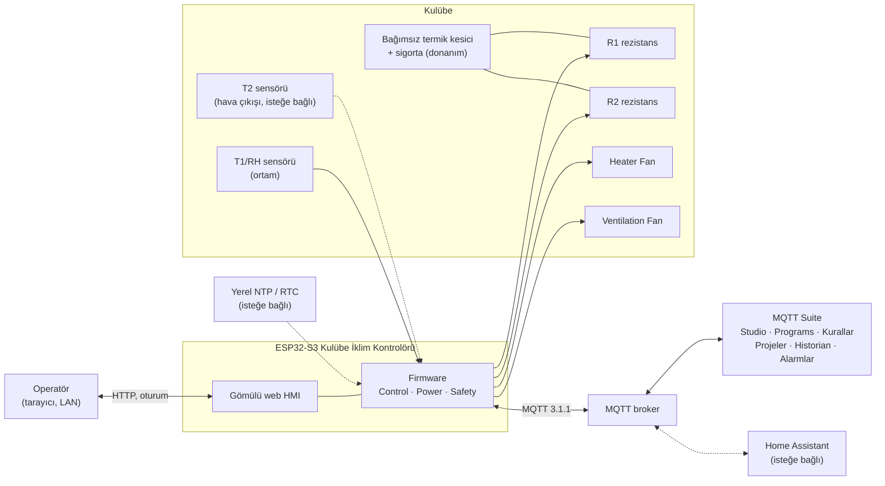
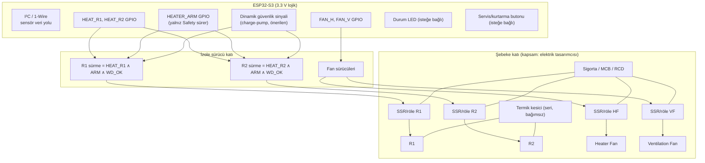
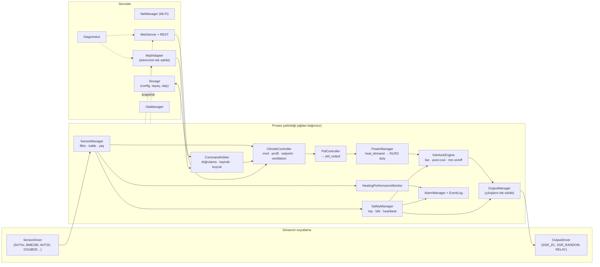
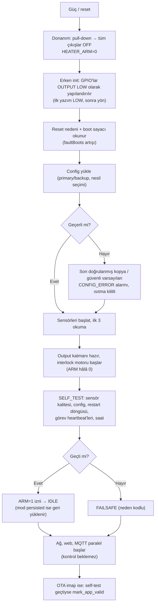

# Sistem Mimarisi

## 1. Sistem bağlamı

**DESIGN DECISION:** Cihaz tek otorite; Suite, web ve HA yalnız istek üretir. Çıkışın tek sahibi cihaz içindeki Output katmanıdır (scada-device-baseline §2).

## 2. Donanım blok görünümü (mantıksal)

Pin ve parça seçimi yapılmamıştır; aşağıdaki blok sınırları bağlayıcıdır.

- **DESIGN DECISION:** Rezistans sürme yolu iki bağımsız yazılım sinyaline (kanal GPIO + `HEATER_ARM`) ve tercihen bir dinamik sinyale bağlıdır. Tek GPIO'nun takılı kalması rezistansı enerjilendiremez ([ADR-008](ADR/ADR-008-hardware-arm-line.md)).
- **DESIGN DECISION:** Heater Fan sürme yolu ARM'a bağlı **değildir**; güvenli durumda fanın çalışabilmesi gerekir (post-cool).
- **ASSUMPTION:** Tüm heater/fan sürücü girişlerinde donanım pull-down vardır; boot sırasında yüzen pin enerjilendirme yapmaz. Strapping pinleri (ESP32-S3: GPIO0, 3, 45, 46) çıkış için kullanılmaz.
- **OPEN ISSUE:** Fan geri bildirimi (akım trafosu, RPM, hava akış anahtarı) v1'de yok; `HEATER_FAN_FAULT` yalnız T2 varsa dolaylı algılanır.

## 3. Mantıksal yazılım mimarisi

**DESIGN DECISION:** Proses çekirdeği ağ, HTTP ve MQTT kütüphanelerine bağımlı değildir; host'ta native test edilebilir saf modüllerdir (PID, PowerManager, InterlockEngine, profil çözücü, HPM, alarm durum makinesi, konfigürasyon doğrulayıcı).

## 4. FreeRTOS görev mimarisi (konsept)

| Görev | Öncelik (göreli) | Periyot / tetik | Sahip olduğu durum | Watchdog |
|---|---|---|---|---|
| SafetyTask | En yüksek (uygulama) | 250 ms + olay | Safety kilitleri, ARM hattı | TWDT abone; diğer görevlerin heartbeat'ini denetler |
| OutputTask | Yüksek | 100 ms (zaman-oransal pencere çözünürlüğü) | GPIO durumları, min on/off zamanlayıcıları, anahtarlama sayaçları | TWDT abone |
| ControlTask | Orta-yüksek | 2 s (`control_interval_s`) | Mod/profil/PID/PowerManager durumu | Heartbeat → Safety |
| SensorTask | Orta-yüksek | 1 s (`sensor_interval_s`) | Ham ve filtrelenmiş ölçümler, kalite | Heartbeat → Safety |
| NetTask (Wi-Fi + MQTT) | Orta | Olay + 250 ms servis | MQTT istemcisi, yayın zamanlayıcıları | Heartbeat (yalnız izleme; kontrolü etkilemez) |
| WebTask (httpd) | Orta-düşük | İstek | Oturumlar | Heartbeat (izleme) |
| StorageTask | Düşük | Olay (dirty) + azami flush | Flash dosyaları | Heartbeat (izleme) |
| DiagTask | Düşük | 1–10 s | Tanı sayaçları, trend halka tamponu | — |

- **DESIGN DECISION:** Çekirdek yerleşimi ölçüme göre seçilir; başlangıç önerisi Wi-Fi/NetTask çekirdek 0, Safety/Output/Control/Sensor çekirdek 1. Bu bir şart değildir (baseline §10).
- **DESIGN DECISION — tek sahiplik:** GPIO yalnız OutputTask; MQTT istemcisi yalnız NetTask; flash yalnız StorageTask. Diğer görevler **kuyruk** (komut, yayın bayrağı, kayıt isteği) veya **sürümlü snapshot** kullanır.
- **DESIGN DECISION — paylaşılan durum:** `ProcessSnapshot` (ölçümler, talepler, çıkış requested/effective/reason, durumlar) ControlTask tarafından üretilir ve çift tamponlu + sıra sayaçlı (seqlock) yayınlanır; okuyucular kilitsiz tutarlı kopya alır. `volatile` eşzamanlama aracı olarak kullanılmaz.
- **DESIGN DECISION — kilit sırası:** `fsMutex → sysMutex`; flash I/O sırasında RAM kilidi, ağ çağrısı sırasında hiçbir kilit tutulmaz (baseline §2).
- **DESIGN DECISION — komut yolu:** HTTP ve MQTT handler'ları doğrulanmış `Command` nesnesini sınırlı `cmdQueue`'ya (ör. 16) bırakır; dolu kuyruk `503/BUSY` ile görünür ret üretir. Handler hiçbir çıkışı sürmez.

### 4.1 Heartbeat ve takılı görev tespiti

| İzlenen | Beklenen artış | Kaçırma sınırı | Eylem |
|---|---|---|---|
| ControlTask | her 2 s | 3 periyot (6 s) | `INTERNAL_FAULT` → rezistans OFF, POST_COOL, FAILSAFE |
| SensorTask | her 1 s | 5 s | Sensör bayat sayılır → `SENSOR_STALE` yolu |
| OutputTask | her 100 ms | 1 s | Safety `HEATER_ARM=0` (donanım yolu), reboot planı |
| SafetyTask | TWDT | TWDT timeout 5 s | Panic → reset; boot'ta `WATCHDOG_RESET` alarmı |
| NetTask/WebTask | 5 s | 60 s | Yalnız tanı + servis yeniden başlatma; proses etkilenmez |

- Idle görevler TWDT'den çıkarılmaz; gecikme kaynağı düzeltilir (baseline §10).
- **FUTURE ENHANCEMENT:** Harici donanım watchdog (dinamik sinyal) — MCU tamamen donarsa rezistans sürme sinyali kendiliğinden düşer.

## 5. Boot ve self-test sırası

- **DESIGN DECISION:** Ağ servisleri kontrolün önkoşulu değildir; SELF_TEST ağdan bağımsızdır.
- **DESIGN DECISION:** `faultBoots ≥ restart_storm_limit` (ör. 5 hatalı boot / 30 dk) ise ısıtma `RECOVERY` durumunda kilitli başlar; operatör onayı gerekir (restart fırtınasında rezistans açıp kapamayı önler).
- **DESIGN DECISION:** Mod ve profil persist edilir; güç dönüşünde `AUTO` geri yüklenir (kulübede kışın ısıtmanın kendiliğinden devam etmesi beklenen davranış). **OPEN ISSUE:** `MANUAL` modun güç dönüşünde `AUTO`'ya mı yoksa `OFF`'a mı düşeceği — öneri: `AUTO`.

## 6. Ağ ve web sunucusu (özet)

| Konu | Karar |
|---|---|
| Wi-Fi | STA; statik/DHCP; statik başarısızsa DHCP kurtarma + alarm (baseline §5) |
| Kurulum | İlk kurulumda AP (`KulubeIklim-XXXX`); AP parolası etiketli; kurulum sonrası kapanır |
| Web | HTTP (yerel); oturum çerezi `SameSite=Strict`, yazmada `X-SCADA: 1` başlığı; bkz. [SECURITY.md](SECURITY.md) |
| Canlı veri | `GET /api/data` 1 s polling, stale 4 s ([ADR-006](ADR/ADR-006-web-live-data.md)) |
| mDNS | `kulube-iklim.local` (değiştirilebilir); tek erişim yolu değildir, IP görünür |
| MQTT | Broker isteğe bağlı; yokluğu yerel kontrolü etkilemez |

## 7. OTA

| Adım | Davranış |
|---|---|
| Ön koşul | Yetkili oturum + OTA parolası; `controller_state` FAILSAFE değil veya servis onayı |
| Hazırlık | Yeni ısıtma talepleri durdurulur → R1/R2 OFF → POST_COOL tamamlanır → `OTA_PREP` olayı |
| Yazım | Pasif OTA bölümüne; ilerleme UI'da; bu sürede R1/R2 kilitli OFF, ARM=0, Heater Fan OFF (post-cool bitti), Ventilation Fan son otomatik durumunda veya OFF (config) |
| Doğrulama | İmaj SHA-256 + boyut + `fw_compat` (hw_rev, config şema sürümü) metadata |
| Aktivasyon | Reboot; yeni imaj `PENDING_VERIFY`; SELF_TEST + 60 s kararlı çalışma → `mark_app_valid` |
| Rollback | Self-test başarısız, boot döngüsü veya 60 s içinde panic → önceki imaj |
| Donma riski | `T1 < frost_guard_temperature + 2 °C` iken OTA reddedilir (**DESIGN DECISION**; servis onayıyla aşılabilir) |

- **OPEN ISSUE:** İmza doğrulama (Secure Boot v2 / imzalı OTA) v1'de etkin değil; OTA parolası kimlik doğrulamadır, firmware imzası değildir.

## 8. Bellek ve bütçe (başlangıç tahmini — ölçülecek)

| Kalem | Tahmin |
|---|---|
| Trend halka tamponu (1 sa @5 s + 24 sa @60 s, 12 B/örnek) | ≈ 26 KB |
| Olay günlüğü RAM halkası (200 × 48 B) | ≈ 10 KB |
| MQTT tamponu | 2 KB (keşif yükü + state ≈ 1.3 KB) |
| Web UI varlıkları (gzip, flash) | ≈ 35 KB + font ≈ 105 KB |
| HTTP oturumları (4) | < 1 KB |

**ASSUMPTION:** ESP32-S3 SRAM'i bu bütçeye yeter; PSRAM yalnız uzun trend için FUTURE.
