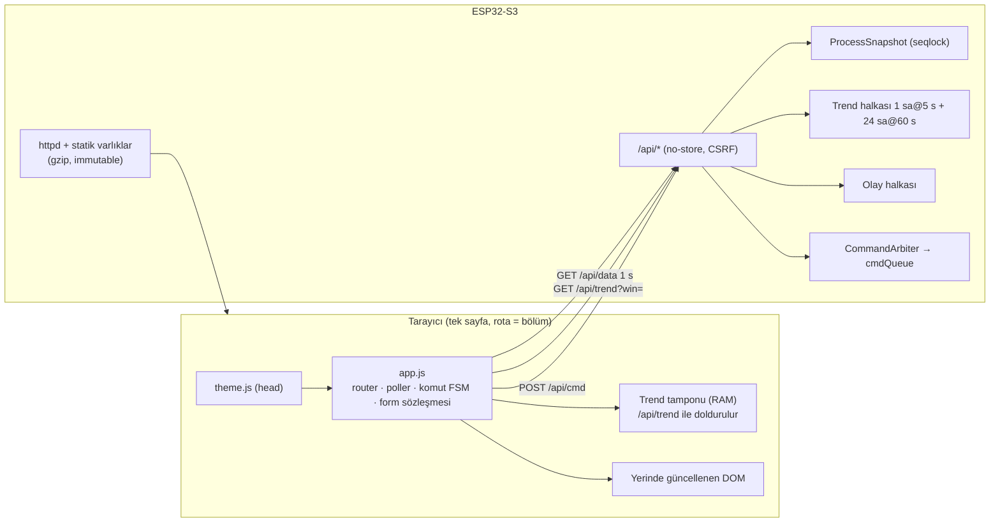

# Gömülü Web SCADA Arayüzü

Standart: **scada-ui-design** (görünüm, etkileşim, ayarlar, teslim, test) + **scada-device-baseline** §6–§8 (tema token'ları, erişim, oturum). Bu belge yalnız cihaza özgü uyarlamaları ve ekran tasarımını tanımlar; token bloğu, tipografi ölçeği (10/11/12/14 px), IBM Plex Sans/Mono, ikon seti, form sözleşmesi ve test kiti skill'den **aynen** alınır, burada tekrarlanmaz.

Arayüz MQTT'den bağımsızdır; yalnız cihazın REST uçlarını kullanır. Gereksiz animasyon, parıltı, oyun tarzı gösterge veya tüketici IoT estetiği kullanılmaz.

## 1. UI profili

| Alan | Karar |
|---|---|
| Hedef | ESP32-S3, httpd; varlıklar gzip + `?v=<sha>` PROGMEM/flash |
| Sayfalar | Genel Bakış `/`, Kontrol `/control`, Trendler `/trends`, Çıkışlar `/outputs`, Alarmlar `/alarms`, Olaylar `/events`, Ayarlar `/settings`, Oturum `/login` |
| Kanal/nesne | 4 çıkış (R1, R2, HF, VF), 1–2 sıcaklık, 1 nem |
| Canlı veri | `GET /api/data` 1 s, `STALE_MS=4000`, `CONFIRM_MS=5000` |
| Tema | Koyu + açık, `scada-tema` tercih anahtarı |
| Programlar sayfası | **Yok (v1)** — zamanlama Suite Programs'tadır; yerel haftalık program FUTURE |
| LED ayar bölümü | Donanım seçilirse; aksi hâlde bölüm yok |

### 1.1 Skill'den bilinçli sapmalar

| Skill kuralı | Bu cihazda | Gerekçe |
|---|---|---|
| Menü 6 öğe (Kontrol, Programlar, Alarmlar, Denetim, Ayarlar, Oturum), mobil 3×2 | 8 öğe; mobil **4×2**; "Denetim" → "Olaylar" | Görev tanımı Overview/Trends/Outputs ayrı ekranları istiyor; Programlar yerelde yok. 4×2 ızgarada öğe ≥ 44 px korunur |
| Ayarlarda 7 standart bölüm | 8 bölüm: `net`, `mqtt`, `io`→**Sensörler**, **`ctrl` Kontrol** (eklenti), `safety`, `led` (koşullu), `access`, `maint` | Skill "ek modül io ile safety arasına kendi sekmesi" kuralı |
| Kontrol kartları 4 sütun | Genel Bakış'ta proses paneli + 4 çıkış kartı | Kanal sayısı 4 |

## 2. Web UI mimarisi



## 3. Kabuk

- **Başlık** (lacivert bant): üst etiket `SCALE · İKLİM KONTROL`, cihaz adı (`h1`, 14 px Mono), bilgi + tema ikon düğmeleri. Kimlik şeridi: `IP · kulube-iklim.local · İstemci IP · FW 1.0.0 · r12`.
- **Menü**: 8 öğe, ikon 16 px + Mono 12 px; ikonlar: gösterge (Genel Bakış), termometre (Kontrol), çizgi grafik (Trendler), power (Çıkışlar), çan (Alarmlar), belge (Olaylar), ayar (Ayarlar), kullanıcı (Oturum). Masaüstü 8 eşit sütun (dar masaüstünde ≤ 1000 px 4×2).
- **Durum çubuğu**: `● Canlı · şimdi`, haplar `Wi-Fi · Hazır`, `MQTT · Hazır`, `Keşif · Yayımlandı`, `Sensör · İyi`, `Saat · Eşitli`. Her hap metin + ikon; renk tek anlam taşıyıcı değildir.
- **Genel uyarılar** (`main` başı): bayat veri (kritik, `role=alert`), `FAILSAFE` (kritik, nedenle), `SERVICE` modu etkin (uyarı, kalan süre), parola tanımsız (uyarı), AP kurulum modu, `controller_enable=OFF` (kritik: "Donma koruması dahil otomatik kontrol kapalı").
- **Sistem durumu** `<details>`: uptime, free/min heap, en uzun kontrol döngüsü, reset nedeni, boots/faultBoots, RSSI, MQTT yeniden bağlanma, sensör hata oranı.
- **Altbilgi**: `FW 1.0.0 · r12 · 14:21:03 | Saat bekleniyor`.

## 4. Genel Bakış (`/`)

Hiyerarşi: **birincil proses değerleri > ısıtma zinciri > havalandırma > kontrolör > sağlık**. Kumanda bu sayfada yalnız setpoint ve mod içindir; diğer kumandalar Kontrol/Çıkışlar sayfalarındadır.

### 4.1 Masaüstü (1280 px)

```text
┌──────────────────────────────────────────────────────────────────────────────────────────┐
│ SCALE · İKLİM KONTROL                                                        (i) (◐)     │
│ Kulübe İklim 01                                                                          │
│ IP 192.168.1.57 · kulube-iklim.local · İstemci 192.168.1.20 · FW 1.0.0 · r12             │
│ [Genel*] [Kontrol] [Trendler] [Çıkışlar] [Alarmlar] [Olaylar] [Ayarlar] [Oturum]          │
├──────────────────────────────────────────────────────────────────────────────────────────┤
│ GENEL BAKIŞ          ● Canlı · şimdi  (Wi-Fi·Hazır) (MQTT·Hazır) (Sensör·İyi) (Saat·Eşitli)│
│ ┌ PROSES ─────────────────────────────┐ ┌ KONTROLÖR ──────────────────────────────────┐  │
│ │ KULÜBE SICAKLIĞI         NEM         │ │ Mod        [OFF][AUTO●][MANUEL][HAVALANDIRMA]│  │
│ │   21.8 °C               48.2 %       │ │ Durum      ▲ ISITIYOR · PID                  │  │
│ │ Hedef  [ 22.0 ] °C  (Uygula)         │ │ Profil     DAY  (Etkin hedef 21.6 °C, rampa) │  │
│ │ Etkin hedef 21.6 °C · DAY · rampa    │ │ Talep      43.5 %  (PID 46.1 %)              │  │
│ │ Değişim +0.9 °C/sa   Kalite İYİ      │ │ Kademe     1 · R1 %87 · R2 %0                │  │
│ └──────────────────────────────────────┘ └──────────────────────────────────────────────┘  │
│ ┌ ISI TALEBİ ─────────────────────────────────────────────────────────────────────────┐   │
│ │ ████████████████░░░░░░░░░░░░░░░░░░░░  43 %   ·  kademe sınırı 55 %                   │   │
│ └──────────────────────────────────────────────────────────────────────────────────────┘   │
│ ┌ 01 R1 ────────┐ ┌ 02 R2 ────────┐ ┌ 03 ISITICI FANI ┐ ┌ 04 HAVALANDIRMA ┐              │
│ │ ● ÇALIŞIYOR   │ │ ○ KAPALI      │ │ ● ÇALIŞIYOR     │ │ ○ KAPALI        │              │
│ │ Oran %87      │ │ Oran %0       │ │ Neden: ISITICI  │ │ İstek KAPALI    │              │
│ │ Bugün 3 sa 34 │ │ Bugün 0 sa 41 │ │   INTERLOCK     │ │                 │              │
│ └───────────────┘ └───────────────┘ └─────────────────┘ └─────────────────┘              │
│ ┌ SAĞLIK ──────────────────────────────────────────────────────────────────────────────┐   │
│ │ ✓ Sensör İYİ (1 s)  ✓ Wi-Fi −61 dBm  ✓ MQTT bağlı  ✓ Cihaz normal  ✓ Alarm yok        │   │
│ └──────────────────────────────────────────────────────────────────────────────────────┘   │
│ ▸ Sistem durumu · çalışma 1 g 0 sa · boş RAM 178 KB                                        │
│ FW 1.0.0 · r12 · 14:21:03                                                                  │
└──────────────────────────────────────────────────────────────────────────────────────────┘
```

(Wireframe'deki `●`/`○`/`▲`/`✓` işaretleri yer tutucudur; gerçek arayüz inline SVG ikon setini + metni kullanır, emoji kullanılmaz. `*` etkin menü öğesidir.)

### 4.2 Telefon (390 px)

```text
┌──────────────────────────────┐
│ SCALE · İKLİM      (i) (◐)   │
│ Kulübe İklim 01              │
│ IP 192.168.1.57              │
│ [Genel][Kontrol][Trend][Çıkış]│
│ [Alarm][Olay][Ayar][Oturum]  │
├──────────────────────────────┤
│ ● Canlı · şimdi              │
│ (Wi-Fi)(MQTT)(Sensör)        │
│ ┌ PROSES ──────────────────┐ │
│ │ 21.8 °C          Nem 48 % │ │
│ │ Hedef [22.0] °C (Uygula) │ │
│ │ Etkin 21.6 · DAY         │ │
│ └──────────────────────────┘ │
│ ┌ KONTROLÖR ───────────────┐ │
│ │ Mod  [AUTO ▾]            │ │
│ │ ▲ ISITIYOR · Talep 43 %  │ │
│ │ ███████░░░░░░░           │ │
│ └──────────────────────────┘ │
│ ┌ R1 ─────┐ ┌ R2 ─────┐      │
│ │● ÇALIŞ. │ │○ KAPALI │      │
│ └─────────┘ └─────────┘      │
│ ┌ ISIT.FAN┐ ┌ HAVAL. ─┐      │
│ │● ÇALIŞ. │ │○ KAPALI │      │
│ │ INTERLK │ │         │      │
│ └─────────┘ └─────────┘      │
│ ✓Sensör ✓MQTT ✓Alarm yok     │
└──────────────────────────────┘
```

Telefonda mod seçimi 4 seçenekli radyo grubu (skill: 2–4 seçenek radyo) ≥ 44 px hedeflerle alt alta iki satır.

## 5. Kontrol (`/control`)

Sekmeler (`tablist`): **İklim**, **Profiller**, **Havalandırma**, **PID**.

| Sekme | İçerik | Kumandalar |
|---|---|---|
| İklim | Mod radyo grubu, setpoint, manuel talep (yalnız MANUAL'da etkin; diğer modda disabled + "Yalnız MANUEL modda" nedeni), controller_enable (yalnız ON göstergesi; OFF için onay diyaloğu) | Setpoint, mod, manuel talep |
| Profiller | Profil tablosu (DAY/NIGHT/AWAY/FROST/BOOST setpoint), seçili profil, `sched_night`/`sched_away` durumları ("Suite Programs tarafından"), BOOST başlat/iptal + kalan süre, antifreeze durumu | Profil seçimi, BOOST, profil setpoint'leri |
| Havalandırma | İstek/etkin/neden, otomatik istek kaynakları listesi (TEMP_HIGH, HUMIDITY_HIGH, SCHEDULED, OVERTEMP; her biri etkin/pasif), eşikler, koordinasyon politikası | Manuel havalandırma, süre |
| PID | Canlı `pid_error`, P/I/D katkıları (yatay çubuk), `pid_output` vs `heat_demand`, doyum ve anti-windup rozetleri, kademe; katsayı formu (Kp, Ki, Kd, mod, deadband, rampa) | Katsayı formu (yönetici; "Uygula" ile, bumpless notu) |

PID formu kaydet çubuğu sözleşmesine (skill §8.6) uyar; kaydetmeden önce özet diyaloğu: "Kp 20 → 25. Çıkış anında sabit kalır (bumpless). Uygulansın mı?"

## 6. Çıkışlar (`/outputs`) ve requested/effective gösterimi

### 6.1 Masaüstü tablo

```text
┌ ÇIKIŞLAR ─────────────────────────────────────────────────────────────────────────────┐
│ Gösterilen durum komutlanan çıkıştır (fiziksel geri bildirim yok).                    │
│ Çıkış        İstek        Etkin          Neden                     Bugün   Anahtarlama │
│ 01 R1        OTO (%87)    ● ÇALIŞIYOR    —                         3:34    20 511      │
│ 02 R2        OTO (%0)     ○ KAPALI       —                         0:41     9 120      │
│ 03 Isıt.fanı ○ KAPALI     ● ÇALIŞIYOR    ⚠ Isıtıcı interlock'u     4:12     2 210      │
│ 04 Havalan.  ● AÇIK       ○ KAPALI       ⚠ Donma koruması engeli   0:00       480      │
│              [İsteği değiştir ▾]                                                       │
└───────────────────────────────────────────────────────────────────────────────────────┘
```

### 6.2 Kural

- İstek = etkin ise tek satır "● ÇALIŞIYOR"; farklıysa üç parça: **İstek**, **Etkin**, **Neden** (uyarı üçgeni + metin, `notice warn` sık biçimi). Neden metni reason kodundan Türkçe sözlükle üretilir; kod ipucu (`title`) ve tanıda görünür.
- Güvenlik kaynaklı neden (`OVERTEMPERATURE_LOCKOUT`, `SENSOR_FAULT`) kritik, interlock/zaman nedenleri (`POST_COOL`, `MIN_ON_TIME`) bilgi/uyarı biçimindedir. `POST_COOL` ve `MIN_*` için kalan süre gösterilir ("Soğutma · 38 s").
- Telefonda tablo yerine kart: başlık + etkin rozeti; istek ≠ etkin ise kart altında "İstek: KAPALI · Neden: Isıtıcı interlock'u" iki satırı; bu satırlar gizlenmez (skill: ret/kilit görünür kalır).
- R1/R2 satırlarında istek kumandası **yoktur**. Service modu etkinken "Test" sütunu açılır (§10).
- Güç simgesi renkleri skill kuralı: açık `--pw-on`, kapalı `--pw-off` (alarm değildir), bilinmiyor/bayat `--pw-unknown`.

## 7. Trendler (`/trends`)

### 7.1 Seriler

| Seri | Eksen | Gösterim |
|---|---|---|
| temperature | Sol °C | Sürekli çizgi |
| setpoint_effective | Sol °C | Kesikli çizgi (basamak) |
| t2 (varsa) | Sol °C | Noktalı çizgi |
| humidity | Sağ % | İnce çizgi, ayrı işaret |
| heat_demand | Alt panel % | Alan |
| R1, R2, heater_fan, ventilation_fan | Alt şerit (Gantt) | 4 satır açık/kapalı çubukları, etiketli |

Seri renkleri token'dan; her serinin yanında çizgi tipi + etiket (renk tek ayırt edici değil). Grafik inline SVG; kütüphane yok.

### 7.2 Veri kaynağı ve bellek

| Katman | Çözünürlük | Kapasite | Kaynak |
|---|---|---|---|
| Cihaz halkası A | 5 s | 720 örnek (1 sa) | RAM, ~8.6 KB |
| Cihaz halkası B | 60 s (ortalama; bit alanları için "pencerede açık oranı") | 1440 örnek (24 sa) | RAM, ~17 KB |
| Tarayıcı tamponu | 1 s (polling) | açık oturum süresince, ≤ 3600 örnek | Tarayıcı RAM |
| Uzun dönem | — | — | Suite historian (cihaz yok) |

Pencere → kaynak: 5 dk / 15 dk → halka A + tarayıcı; 1 sa → A; 6 sa / 24 sa → B. Sayfa açılışında `GET /api/trend?win=3600` (ikili sıkışık format veya CSV benzeri kompakt JSON dizileri, `?res=`), sonra canlı `/api/data` ile uzatılır. Ekrana çizim piksel başına min/max decimation (LTTB veya min-max kovası) ile ≤ 600 nokta.

- **DESIGN DECISION:** Trend halkaları kalıcı değildir (flash aşınması, kapsam); reboot sonrası boş başlar ve UI "Cihaz yeniden başladı: 14:02'den önce veri yok" notu gösterir.
- **ASSUMPTION:** Örnek boyutu 12 B (t 32 bit uptime-sn, T/SP/T2 int16 ×0.01, RH uint16 ×0.01, talep uint8, bitler uint8).
- Saat geçersizse eksen göreli ("−15 dk") çizilir.

## 8. Alarmlar (`/alarms`)

- Aktif alarmlar üstte (önem sırasıyla), geçmiş (RAM halkası son 50 + kalıcı son 32 kritik) altta. Satır: önem ikonu + kod metni + başlangıç zamanı + durum (`Aktif · Onaysız`, `Aktif · Onaylı`, `Giderildi · Onaysız`) + kilitliyse "Sıfırlama gerekli".
- Eylemler: "Onayla" (tekil / tümü), "Kilidi sıfırla" (ayrı, onaylı; koşul sürüyorsa disabled + "Koşul sürüyor: T1 41.2 °C ≥ 40.0 °C").
- Satırlar sık biçim (10 px yazı, 4 px aralık); onay kapsamı: "Onay cihazda kalıcıdır ve MQTT'ye yayınlanır."

## 9. Olaylar (`/events`)

Skill'deki Denetim listesi biçimi: rozet (`STATE`, `SAFETY`, `COMMAND`, `OUTPUT`, `ALARM`, `CONFIG`, `NET`, `SYSTEM`) · sıra + zaman · olay metni. Filtre: kaynak, önem; "Son 200 olay RAM'de, kritik olaylar kalıcı (son 64)". Dışa aktarma: CSV indir (yönetici).

## 10. Service (Ayarlar › Bakım + Çıkışlar test sütunu)

| İşlem | Konum | Koruma |
|---|---|---|
| Servis moduna gir/çık | Ayarlar › Bakım (kırmızı alan) | Yönetici oturumu + servis PIN'i (ayrı), onay diyaloğu, talep 0 + post-cool bitmeden girilmez |
| Çıkış testi (R1, R2, HF, VF) | Çıkışlar › Test sütunu (yalnız SERVICE) | Tek seferde tek rezistans, ≤ 120 s, interlock etkin, geri sayım görünür, sayfa kapanırsa test biter |
| Sensör kalibrasyonu | Ayarlar › Sensörler | Yönetici; ham/düzeltilmiş önizleme |
| Alarm kilidi sıfırlama | Alarmlar | Yönetici; koşul temiz |
| Yeniden başlat | Bakım | Onay: "Rezistanslar kapatılıp soğutma tamamlandıktan sonra cihaz yeniden başlatılsın mı?" |
| Konfigürasyon yedeği indir / geri yükle | Bakım | Yönetici; yedek sırsız; geri yükleme önizleme + tam doğrulama |
| Sayaç sıfırlama (çalışma saati/anahtarlama) | Bakım | Tek/tüm seçimi + onay; önceki değer olay günlüğüne |
| Fabrika ayarları | Bakım | Onay metni kapsamı yazar; Wi-Fi korunur/silinir seçimi |
| OTA yükleme | Bakım | OTA parolası; [SYSTEM_ARCHITECTURE §7](SYSTEM_ARCHITECTURE.md) |

## 11. Ayarlar bölümleri

| # | id | Sekme | İçerik |
|---|---|---|---|
| 1 | `net` | Ağ | Skill kataloğu (cihaz/mDNS adı, DHCP/statik) |
| 2 | `mqtt` | MQTT | Broker, kullanıcı/parola, kök topic `mqttsuite/climate`, SLUG (salt okunur + "Taşı…" sihirbazı), yayın aralıkları, keşif, `remote_config_enabled`, servis kanalı |
| 3 | `io` | Sensörler | Sürücü seçimi, rol eşlemesi, T2 etkin, kalibrasyon, örnekleme, filtre |
| 4 | `ctrl` | Kontrol | Isıtma (sürücü profili, pencere, min on/off, kademe eşikleri, güç), post-cool, havalandırma koordinasyonu, profil varsayılanları |
| 5 | `safety` | Güvenlik | Safety limitleri (yalnız yönetici), antifreeze, zaman aşımları, restart storm |
| 6 | `led` | LED | Yalnız donanım seçilirse |
| 7 | `access` | Erişim | Skill kataloğu + servis PIN'i |
| 8 | `maint` | Bakım | Kırmızı alan (§10) |

Alan listesi ve aralıklar [CONFIGURATION_MODEL.md](CONFIGURATION_MODEL.md)'den **bildirimsel** üretilir (skill §8.3 `definitions`); istemci sınırları sunucu sınırlarını yansıtır.

## 12. Komut akışı

Skill §7: `hazır → gönderiliyor → onay bekleniyor → onaylandı | reddedildi | zaman aşımı`. `POST /api/cmd` yanıtı:

```json
{"result":"OVERRIDDEN","id":"heater_fan_manual","value":"OFF","reason":"HEATER_INTERLOCK","seq":18245}
```

Onay, `seq ≥ 18245` olan `/api/data`'da istek alanının istenen değere eşit olmasıyla verilir. `OVERRIDDEN` UI'da başarı + bilgi notu olarak gösterilir: "İstek kaydedildi; fan ısıtıcı interlock'u nedeniyle çalışmaya devam ediyor."

## 13. REST uçları (özet)

| Uç | Yöntem | Yetki | İçerik |
|---|---|---|---|
| `/api/data` | GET | Misafir (ayarlıysa) / kullanıcı | Snapshot (`B/state` alanları + kimlik + veri yaşı) |
| `/api/trend?win=&res=` | GET | Misafir/kullanıcı | Trend dizileri |
| `/api/cmd` | POST | Operatör | `{id, value}` operasyonel komut |
| `/api/settings` | GET/POST | Yönetici | Skill §8.5 sözleşmesi |
| `/api/alarms`, `/api/alarms/ack`, `/api/alarms/reset` | GET/POST | Operatör / yönetici | |
| `/api/events?after=` | GET | Kullanıcı | Sayfalı olaylar |
| `/api/diag` | GET | Kullanıcı | `B/diag/state` + görev yığın payları |
| `/api/service/*` | POST | Yönetici + servis oturumu | Test, kalibrasyon, sayaç reset |
| `/api/ota` | POST | Yönetici + OTA parolası | |
| `/api/password`, `/api/question`, `/api/login`, `/api/logout` | POST | Skill §8.5 | |

Bütün yazma uçları `X-SCADA: 1` + `SameSite=Strict` çerez; `Cache-Control: no-store`.

## 14. Erişilebilirlik ve kabul

Skill §10 matrisi (2 tema × 390/768/1280 + 320 px + %200 zoom) her sayfa ve her ayar sekmesi için. Ek cihaz kabulü:

- Genel Bakış'ta T1, setpoint, nem ilk ekranda (1280 × 720 ve 390 × 844) kaydırmasız görünür.
- İstek ≠ etkin durumu hem masaüstü tabloda hem telefon kartında metinle görünür.
- Bayat veride setpoint ve mod kumandaları `aria-disabled` + neden metni.
- MANUAL dışı modda manuel talep alanı disabled ve nedeni görünür.
- Servis modu etkinken her sayfada kalıcı uyarı bandı ve kalan süre.
- Trend grafiğinde her seri renk dışında çizgi tipi/etiketle ayırt edilir; grafik için tablo alternatifi (son 20 örnek) `details` içinde.
